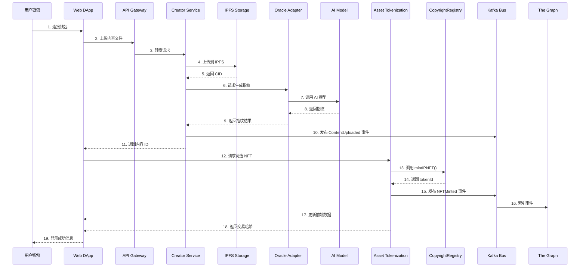
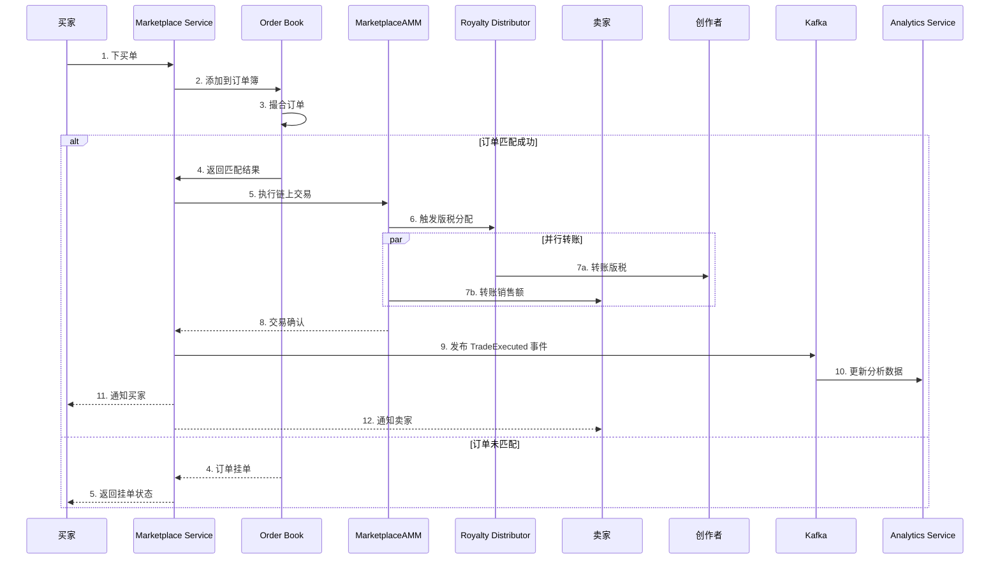
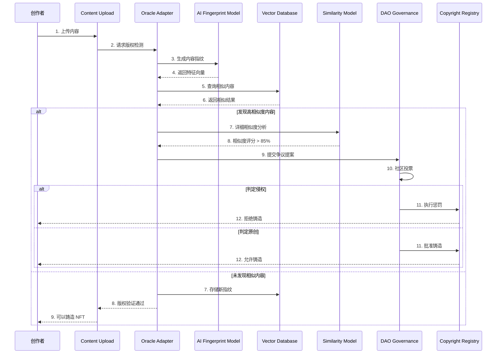
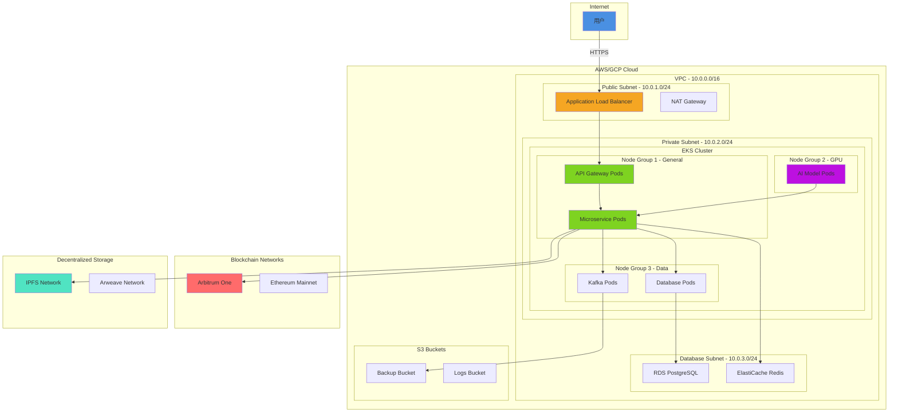
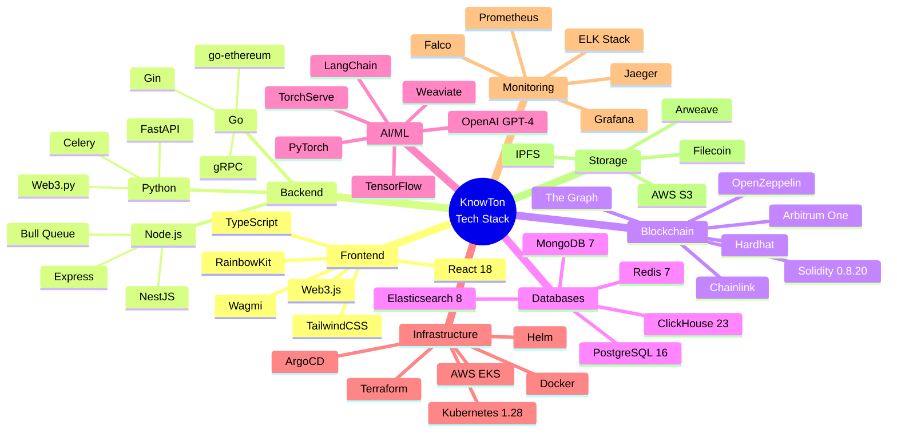

# KnowTon 完整技术架构图

## 总体架构视图

```mermaid
graph TB
    subgraph "客户端层 Client Layer"
        WebApp[Web DApp<br/>React + Web3.js + Wagmi]
        MobileApp[Mobile DApp<br/>React Native + WalletConnect]
        ThirdPartySDK[Third-party SDK<br/>JavaScript/Python/Go]
    end
    
    subgraph "CDN & Edge"
        CloudFlare[CloudFlare CDN]
        EdgeCache[Edge Caching]
    end
    
    subgraph "API Gateway Layer - K8s Ingress"
        direction LR
        Ingress[Nginx Ingress Controller]
        Kong[Kong API Gateway<br/>Rate Limiting, Auth, CORS]
        BFF[Backend for Frontend<br/>Node.js/TypeScript]
    end
    
    subgraph "Authentication & Identity Layer - K8s Deployment"
        direction TB
        WalletAuth[Wallet Authentication<br/>SIWE - Sign-In with Ethereum]
        SBT[Soul-Bound Token Service<br/>Non-transferable Credentials]
        KYC[KYC/AML Service<br/>Compliance Verification]
        DID[DID Resolver<br/>Ceramic Network]
    end
    
    subgraph "Business Microservices Layer - K8s Deployments"
        direction TB
        
        subgraph "Content & Creator Services"
            CreatorSvc[Creator Service<br/>Node.js + Express<br/>Port: 3001]
            ContentMgmt[Content Management<br/>Upload, Metadata, IPFS]
        end
        
        subgraph "Blockchain Services"
            AssetToken[Asset Tokenization<br/>Go + Gin<br/>Port: 8080]
            RoyaltySvc[Royalty Distribution<br/>Node.js + Bull Queue<br/>Port: 3002]
            BondingSvc[Bonding/Tranche<br/>Go + gRPC<br/>Port: 9090]
        end
        
        subgraph "Trading Services"
            MarketplaceSvc[Marketplace Service<br/>Node.js + WebSocket<br/>Port: 3003]
            OrderBook[Order Book Engine<br/>Redis + In-Memory]
        end
        
        subgraph "DeFi Integration"
            LendingAdapter[Lending Adapter<br/>Python + FastAPI<br/>Port: 8000]
            OracleAdapter[Oracle Adapter<br/>Python + FastAPI<br/>Port: 8001]
        end
        
        subgraph "Analytics & Insights"
            AnalyticsSvc[Analytics Service<br/>Python + Spark<br/>Port: 8002]
            ReportGen[Report Generation<br/>Pandas + Matplotlib]
        end
    end
    
    subgraph "Message Bus Layer - K8s StatefulSet"
        direction LR
        Kafka[Apache Kafka Cluster<br/>3 Brokers<br/>Topics: nft-minted, trades, royalty]
        KafkaConnect[Kafka Connect<br/>CDC, Sink Connectors]
        SchemaRegistry[Schema Registry<br/>Avro Schemas]
    end
    
    subgraph "Blockchain Layer - Arbitrum One L2"
        direction TB
        
        subgraph "Smart Contracts"
            CopyrightReg[CopyrightRegistry.sol<br/>ERC-721/1155<br/>NFT Minting & Metadata]
            RoyaltyFactory[RoyaltyTokenFactory.sol<br/>ERC-20<br/>Royalty Token Issuance]
            RoyaltyDist[RoyaltyDistributor.sol<br/>Automated Revenue Split]
            IPBondContract[IPBond.sol<br/>Tranche System<br/>Senior/Mezzanine/Junior]
            MarketplaceAMM[MarketplaceAMM.sol<br/>Uniswap V3 Integration]
            LendingContract[LendingAdapter.sol<br/>Aave/Compound Integration]
            Governance[DAOGovernance.sol<br/>Voting & Proposals]
            Staking[StakingRewards.sol<br/>Token Staking & APY]
        end
        
        subgraph "Layer 2 Infrastructure"
            ArbitrumNode[Arbitrum Sequencer]
            L2Bridge[L1-L2 Bridge]
            GasOptimizer[Gas Optimizer]
        end
    end
    
    subgraph "Decentralized Storage Layer"
        direction LR
        IPFS[IPFS Cluster<br/>Pinata/Infura<br/>Hot Storage]
        Arweave[Arweave<br/>Permanent Storage<br/>Cold Archive]
        Filecoin[Filecoin<br/>Backup Layer<br/>Redundancy]
    end
    
    subgraph "Indexing & Database Layer - K8s StatefulSets"
        direction TB
        
        subgraph "Blockchain Indexing"
            TheGraph[The Graph<br/>Subgraph Indexer<br/>GraphQL API]
            Subgraph[Custom Subgraph<br/>Event Listeners]
        end
        
        subgraph "Relational Databases"
            PostgresMain[PostgreSQL Primary<br/>Users, Metadata<br/>500GB SSD]
            PostgresReplica[PostgreSQL Replicas<br/>Read Scaling]
        end
        
        subgraph "Analytics Databases"
            ClickHouse[ClickHouse Cluster<br/>OLAP Analytics<br/>3 Shards, 2 Replicas<br/>1TB Storage]
        end
        
        subgraph "NoSQL & Cache"
            MongoDB[MongoDB<br/>Content Metadata<br/>Flexible Schema]
            RedisCluster[Redis Cluster<br/>6 Nodes<br/>Cache + Session]
        end
        
        subgraph "Search Engine"
            Elasticsearch[Elasticsearch<br/>Full-text Search<br/>3 Nodes]
        end
    end
    
    subgraph "AI & ML Layer - K8s GPU Nodes"
        direction TB
        
        subgraph "Model Serving"
            TorchServe[TorchServe<br/>GPU: NVIDIA A10G<br/>Batch Inference]
            TFServing[TensorFlow Serving<br/>Model Versioning]
        end
        
        subgraph "AI Models"
            FingerprintModel[Content Fingerprinting<br/>ResNet-50, EfficientNet<br/>Image/Video/Audio]
            SimilarityModel[Similarity Detection<br/>Siamese Networks<br/>Cosine Similarity]
            RecommendModel[Recommendation Engine<br/>Collaborative Filtering<br/>Graph Neural Networks]
            ValuationModel[Valuation Model<br/>Regression + Time Series<br/>Price Prediction]
        end
        
        subgraph "Vector Database"
            Weaviate[Weaviate<br/>Vector Search<br/>Semantic Similarity]
            Pinecone[Pinecone<br/>Managed Vector DB<br/>Backup Option]
        end
        
        subgraph "RAG & LLM"
            LangChain[LangChain<br/>RAG Pipeline]
            OpenAI[OpenAI API<br/>GPT-4 Integration]
        end
    end
    
    subgraph "External Integrations"
        direction LR
        
        subgraph "DeFi Protocols"
            Uniswap[Uniswap V3<br/>DEX Liquidity]
            Aave[Aave V3<br/>Lending Protocol]
            Compound[Compound<br/>Money Market]
            Chainlink[Chainlink<br/>Price Oracles]
        end
        
        subgraph "NFT Marketplaces"
            OpenSea[OpenSea API<br/>Cross-listing]
            Rarible[Rarible Protocol<br/>Marketplace]
        end
        
        subgraph "Fiat On/Off Ramp"
            MoonPay[MoonPay<br/>Credit Card Purchase]
            Transak[Transak<br/>Bank Transfer]
        end
        
        subgraph "Identity & Domain"
            ENS[ENS<br/>Ethereum Name Service]
            Unstoppable[Unstoppable Domains<br/>Web3 Identity]
        end
    end
    
    subgraph "Monitoring & Observability - K8s Monitoring Namespace"
        direction TB
        
        subgraph "Metrics"
            Prometheus[Prometheus<br/>Time-series Metrics<br/>30 Days Retention]
            Grafana[Grafana<br/>Dashboards & Alerts<br/>10+ Dashboards]
        end
        
        subgraph "Logging"
            Elasticsearch2[Elasticsearch<br/>Log Storage]
            Logstash[Logstash<br/>Log Processing]
            Kibana[Kibana<br/>Log Visualization]
            Fluentd[Fluentd<br/>Log Collection]
        end
        
        subgraph "Tracing"
            Jaeger[Jaeger<br/>Distributed Tracing<br/>Request Flow]
        end
        
        subgraph "Alerting"
            AlertManager[AlertManager<br/>Alert Routing]
            PagerDuty[PagerDuty<br/>On-call Management]
        end
    end
    
    subgraph "Security & Secrets - K8s Security"
        direction LR
        Vault[HashiCorp Vault<br/>Secrets Management<br/>Key Rotation]
        Falco[Falco<br/>Runtime Security<br/>Threat Detection]
        OPA[Open Policy Agent<br/>Policy Enforcement]
        CertManager[Cert-Manager<br/>TLS Certificates]
    end
    
    subgraph "CI/CD & Infrastructure"
        direction TB
        
        subgraph "Source Control"
            GitHub[GitHub<br/>Source Repository<br/>Branch Protection]
        end
        
        subgraph "CI Pipeline"
            GitHubActions[GitHub Actions<br/>Build, Test, Scan]
            SonarQube[SonarQube<br/>Code Quality]
            Snyk[Snyk<br/>Security Scanning]
        end
        
        subgraph "Container Registry"
            GHCR[GitHub Container Registry<br/>Docker Images]
        end
        
        subgraph "CD Pipeline"
            ArgoCD[ArgoCD<br/>GitOps Deployment<br/>Auto-sync]
            Helm[Helm Charts<br/>Package Management]
        end
        
        subgraph "Infrastructure as Code"
            Terraform[Terraform<br/>Cloud Resources<br/>AWS/GCP/Azure]
            Kustomize[Kustomize<br/>K8s Manifests]
        end
    end
    
    %% Client to Gateway
    WebApp --> CloudFlare
    MobileApp --> CloudFlare
    ThirdPartySDK --> CloudFlare
    CloudFlare --> Ingress
    Ingress --> Kong
    Kong --> BFF
    
    %% Gateway to Auth
    BFF --> WalletAuth
    WalletAuth --> SBT
    WalletAuth --> KYC
    WalletAuth --> DID
    
    %% Gateway to Services
    BFF --> CreatorSvc
    BFF --> AssetToken
    BFF --> MarketplaceSvc
    BFF --> AnalyticsSvc
    
    %% Services to Message Bus
    CreatorSvc --> Kafka
    AssetToken --> Kafka
    RoyaltySvc --> Kafka
    MarketplaceSvc --> Kafka
    
    %% Services to Blockchain
    AssetToken --> CopyrightReg
    RoyaltySvc --> RoyaltyDist
    BondingSvc --> IPBondContract
    MarketplaceSvc --> MarketplaceAMM
    LendingAdapter --> LendingContract
    
    %% Services to Storage
    CreatorSvc --> IPFS
    CreatorSvc --> Arweave
    ContentMgmt --> IPFS
    
    %% Blockchain to Indexing
    CopyrightReg --> TheGraph
    RoyaltyDist --> TheGraph
    MarketplaceAMM --> TheGraph
    TheGraph --> Subgraph
    
    %% Message Bus to Databases
    Kafka --> PostgresMain
    Kafka --> ClickHouse
    Kafka --> MongoDB
    KafkaConnect --> PostgresMain
    
    %% Services to Databases
    CreatorSvc --> PostgresMain
    MarketplaceSvc --> RedisCluster
    AnalyticsSvc --> ClickHouse
    
    %% Services to Search
    CreatorSvc --> Elasticsearch
    MarketplaceSvc --> Elasticsearch
    
    %% AI Integration
    OracleAdapter --> TorchServe
    TorchServe --> FingerprintModel
    TorchServe --> ValuationModel
    OracleAdapter --> Weaviate
    OracleAdapter --> LangChain
    
    %% External Integrations
    MarketplaceSvc --> Uniswap
    LendingAdapter --> Aave
    LendingAdapter --> Compound
    OracleAdapter --> Chainlink
    AssetToken --> OpenSea
    
    %% Monitoring
    CreatorSvc -.-> Prometheus
    AssetToken -.-> Prometheus
    MarketplaceSvc -.-> Prometheus
    Kafka -.-> Prometheus
    PostgresMain -.-> Prometheus
    RedisCluster -.-> Prometheus
    
    Prometheus --> Grafana
    Fluentd -.-> Logstash
    Logstash --> Elasticsearch2
    Elasticsearch2 --> Kibana
    
    %% CI/CD Flow
    GitHub --> GitHubActions
    GitHubActions --> GHCR
    GHCR --> ArgoCD
    ArgoCD --> Kong
    ArgoCD --> CreatorSvc
    ArgoCD --> AssetToken
    
    %% Security
    Vault -.-> CreatorSvc
    Vault -.-> AssetToken
    Falco -.-> Kong
    CertManager -.-> Ingress
    
    style WebApp fill:#4A90E2
    style MobileApp fill:#4A90E2
    style Kong fill:#F5A623
    style CopyrightReg fill:#7ED321
    style RoyaltyDist fill:#7ED321
    style Kafka fill:#D0021B
    style PostgresMain fill:#50E3C2
    style ClickHouse fill:#50E3C2
    style TorchServe fill:#BD10E0
    style Prometheus fill:#FF6B6B
    style ArgoCD fill:#4ECDC4
```

## 数据流图

### NFT 铸造流程

```mermaid
sequenceDiagram
    participant User as 用户钱包
    participant Web as Web DApp
    participant Kong as API Gateway
    participant Creator as Creator Service
    participant IPFS as IPFS Storage
    participant Oracle as Oracle Adapter
    participant AI as AI Model
    participant Asset as Asset Tokenization
    participant Contract as CopyrightRegistry
    participant Kafka as Kafka Bus
    participant Graph as The Graph
    
    User->>Web: 1. 连接钱包
    Web->>Kong: 2. 上传内容文件
    Kong->>Creator: 3. 转发请求
    Creator->>IPFS: 4. 上传到 IPFS
    IPFS-->>Creator: 5. 返回 CID
    
    Creator->>Oracle: 6. 请求生成指纹
    Oracle->>AI: 7. 调用 AI 模型
    AI-->>Oracle: 8. 返回指纹
    Oracle-->>Creator: 9. 返回指纹结果
    
    Creator->>Kafka: 10. 发布 ContentUploaded 事件
    Creator-->>Web: 11. 返回内容 ID
    
    Web->>Asset: 12. 请求铸造 NFT
    Asset->>Contract: 13. 调用 mintIPNFT()
    Contract-->>Asset: 14. 返回 tokenId
    Asset->>Kafka: 15. 发布 NFTMinted 事件
    
    Kafka->>Graph: 16. 索引事件
    Graph-->>Web: 17. 更新前端数据
    
    Asset-->>Web: 18. 返回交易哈希
    Web-->>User: 19. 显示成功消息
```

### 交易执行流程

```mermaid
sequenceDiagram
    participant Buyer as 买家
    participant Market as Marketplace Service
    participant OrderBook as Order Book
    participant Contract as MarketplaceAMM
    participant Royalty as Royalty Distributor
    participant Seller as 卖家
    participant Creator as 创作者
    participant Kafka as Kafka
    participant Analytics as Analytics Service
    
    Buyer->>Market: 1. 下买单
    Market->>OrderBook: 2. 添加到订单簿
    OrderBook->>OrderBook: 3. 撮合订单
    
    alt 订单匹配成功
        OrderBook->>Market: 4. 返回匹配结果
        Market->>Contract: 5. 执行链上交易
        Contract->>Royalty: 6. 触发版税分配
        
        par 并行转账
            Royalty->>Creator: 7a. 转账版税
            Contract->>Seller: 7b. 转账销售额
        end
        
        Contract-->>Market: 8. 交易确认
        Market->>Kafka: 9. 发布 TradeExecuted 事件
        Kafka->>Analytics: 10. 更新分析数据
        
        Market-->>Buyer: 11. 通知买家
        Market-->>Seller: 12. 通知卖家
    else 订单未匹配
        OrderBook-->>Market: 4. 订单挂单
        Market-->>Buyer: 5. 返回挂单状态
    end
```

### AI 版权检测流程

```mermaid
sequenceDiagram
    participant Creator as 创作者
    participant Upload as Content Upload
    participant Oracle as Oracle Adapter
    participant AI as AI Fingerprint Model
    participant VectorDB as Vector Database
    participant Similarity as Similarity Model
    participant DAO as DAO Governance
    participant Contract as Copyright Registry
    
    Creator->>Upload: 1. 上传内容
    Upload->>Oracle: 2. 请求版权检测
    Oracle->>AI: 3. 生成内容指纹
    AI-->>Oracle: 4. 返回特征向量
    
    Oracle->>VectorDB: 5. 查询相似内容
    VectorDB-->>Oracle: 6. 返回相似结果
    
    alt 发现高相似度内容
        Oracle->>Similarity: 7. 详细相似度分析
        Similarity-->>Oracle: 8. 相似度评分 > 85%
        
        Oracle->>DAO: 9. 提交争议提案
        DAO->>DAO: 10. 社区投票
        
        alt 判定侵权
            DAO->>Contract: 11. 执行惩罚
            Contract-->>Creator: 12. 拒绝铸造
        else 判定原创
            DAO->>Contract: 11. 批准铸造
            Contract-->>Creator: 12. 允许铸造
        end
    else 未发现相似内容
        Oracle->>VectorDB: 7. 存储新指纹
        Oracle-->>Upload: 8. 版权验证通过
        Upload-->>Creator: 9. 可以铸造 NFT
    end
```

## 网络拓扑图

```mermaid
graph TB
    subgraph "Internet"
        Users[用户]
    end
    
    subgraph "AWS/GCP Cloud"
        subgraph "VPC - 10.0.0.0/16"
            subgraph "Public Subnet - 10.0.1.0/24"
                ALB[Application Load Balancer]
                NAT[NAT Gateway]
            end
            
            subgraph "Private Subnet - 10.0.2.0/24"
                subgraph "EKS Cluster"
                    subgraph "Node Group 1 - General"
                        Pod1[API Gateway Pods]
                        Pod2[Microservice Pods]
                    end
                    
                    subgraph "Node Group 2 - GPU"
                        Pod3[AI Model Pods]
                    end
                    
                    subgraph "Node Group 3 - Data"
                        Pod4[Database Pods]
                        Pod5[Kafka Pods]
                    end
                end
            end
            
            subgraph "Database Subnet - 10.0.3.0/24"
                RDS[RDS PostgreSQL]
                ElastiCache[ElastiCache Redis]
            end
        end
        
        subgraph "S3 Buckets"
            S3Backup[Backup Bucket]
            S3Logs[Logs Bucket]
        end
    end
    
    subgraph "Blockchain Networks"
        Arbitrum[Arbitrum One]
        Ethereum[Ethereum Mainnet]
    end
    
    subgraph "Decentralized Storage"
        IPFSNet[IPFS Network]
        ArweaveNet[Arweave Network]
    end
    
    Users -->|HTTPS| ALB
    ALB --> Pod1
    Pod1 --> Pod2
    Pod2 --> Pod4
    Pod2 --> Pod5
    Pod2 --> Arbitrum
    Pod2 --> IPFSNet
    Pod3 --> Pod2
    
    Pod4 --> RDS
    Pod2 --> ElastiCache
    Pod5 --> S3Backup
    
    style Users fill:#4A90E2
    style ALB fill:#F5A623
    style Pod1 fill:#7ED321
    style Pod2 fill:#7ED321
    style Pod3 fill:#BD10E0
    style Arbitrum fill:#FF6B6B
    style IPFSNet fill:#50E3C2
```

## 技术栈总览

```mermaid
mindmap
  root((KnowTon<br/>Tech Stack))
    Frontend
      React 18
      TypeScript
      Web3.js
      Wagmi
      RainbowKit
      TailwindCSS
    Backend
      Node.js
        Express
        NestJS
        Bull Queue
      Go
        Gin
        gRPC
        go-ethereum
      Python
        FastAPI
        Celery
        Web3.py
    Blockchain
      Solidity 0.8.20
      Hardhat
      OpenZeppelin
      Chainlink
      Arbitrum One
      The Graph
    Databases
      PostgreSQL 16
      ClickHouse 23
      MongoDB 7
      Redis 7
      Elasticsearch 8
    AI/ML
      PyTorch
      TensorFlow
      TorchServe
      Weaviate
      LangChain
      OpenAI GPT-4
    Infrastructure
      Kubernetes 1.28
      Docker
      Helm
      ArgoCD
      Terraform
      AWS EKS
    Monitoring
      Prometheus
      Grafana
      ELK Stack
      Jaeger
      Falco
    Storage
      IPFS
      Arweave
      Filecoin
      AWS S3
```

这个完整的架构图展示了 KnowTon 平台的所有技术组件、数据流和网络拓扑！
