# KnowTon Web3 平台设计文档

## 概述

KnowTon 是一个革命性的 Web3 知识产权平台，将传统知识产权资产（RWA）代币化上链，结合 DeFi 协议实现流动性交易，使用零知识证明保护隐私，并通过 AI 技术实现智能版权验证和内容推荐。平台采用完全去中心化的架构，消除中间商，让创作者和投资者直接交互，实现真正的价值流通。

### 核心创新

- **RWA 代币化**: 将音乐、视频、课程等知识产权铸造为 NFT，实现链上所有权
- **DeFi 集成**: 碎片化交易、流动性挖矿、版税代币化、自动做市商
- **隐私保护**: 零知识证明验证所有权，匿名交易，加密内容访问
- **AI 驱动**: 智能版权检测、内容推荐、价值评估、争议仲裁
- **DAO 治理**: 社区驱动的平台决策和争议解决机制

### 技术目标

- **去中心化**: 无单点故障，抗审查，用户完全掌控资产
- **可扩展性**: 支持 Layer 2 和侧链，降低 gas 费用
- **互操作性**: 跨链资产转移，多链部署
- **安全性**: 智能合约审计，形式化验证，漏洞赏金计划
- **性能**: 亚秒级交易确认（Layer 2），毫秒级查询响应

## 架构

### 系统架构总览

```mermaid
graph TB
    subgraph "客户端层 Client Layer"
        WebClient[Web DApp - React + Web3]
        MobileClient[Mobile DApp - React Native]
        SDKClient[Third-party SDK - JS/Python]
    end
    
    subgraph "API 网关层 API Gateway - K8s Ingress"
        APIGateway[Kong/Traefik Gateway]
        BFF[Backend for Frontend - Node.js/TS]
        RateLimiter[Rate Limiter]
        LoadBalancer[Load Balancer]
    end
    
    subgraph "认证层 Auth & Identity - K8s Deployment"
        WalletAuth[Wallet Authentication]
        SBTService[Soul-Bound Token Service]
        KYCService[KYC/AML Service]
        DIDResolver[DID Resolver - Ceramic]
    end

    subgraph "业务微服务层 Business Microservices - K8s Deployments"
        CreatorService[Creator Service - Node.js]
        AssetTokenization[Asset Tokenization Service - Go]
        RoyaltyService[Royalty & Distribution Service - Node.js]
        BondingService[Bonding/Tranche Service - Go]
        MarketplaceService[Marketplace Service - Node.js]
        LendingAdapter[Lending Adapter Service - Python]
        OracleAdapter[Oracle Adapter Service - Python]
        AnalyticsService[Analytics Service - Python]
    end
    
    subgraph "消息总线 Message Bus - K8s StatefulSet"
        Kafka[Apache Kafka]
        RabbitMQ[RabbitMQ - Optional]
        RedisStream[Redis Streams]
    end
    
    subgraph "区块链层 Blockchain Layer - Arbitrum/zkSync"
        direction TB
        L2Network[Arbitrum One / zkSync Era]
        
        subgraph "智能合约 Smart Contracts"
            CopyrightRegistry[CopyrightRegistry - ERC-721/1155]
            RoyaltyTokenFactory[RoyaltyTokenFactory - ERC-20]
            RoyaltyDistributor[RoyaltyDistributor]
            IPBond[IPBond - Tranche System]
            MarketplaceAMM[Marketplace/AMM Adapters]
            LendingAdapterContract[LendingAdapter Contract]
        end
    end
    
    subgraph "去中心化存储层 Off-chain Storage"
        IPFS[IPFS Cluster - Pinata/Infura]
        Arweave[Arweave - Permanent Storage]
        Filecoin[Filecoin - Backup Layer]
    end
    
    subgraph "索引与数据库层 Indexing & Databases - K8s StatefulSets"
        TheGraph[The Graph - Subgraph Indexer]
        PostgreSQL[PostgreSQL - Metadata & Users]
        ClickHouse[ClickHouse - Analytics OLAP]
        MongoDB[MongoDB - Content Metadata]
        RedisCluster[Redis Cluster - Cache]
        ElasticSearch[ElasticSearch - Full-text Search]
    end
    
    subgraph "AI 层 AI Layer - K8s GPU Nodes"
        ModelServing[Model Serving - TorchServe/TFServing]
        VectorDB[Vector Database - Pinecone/Weaviate]
        RAGEngine[RAG Engine - LangChain]
        
        subgraph "AI 模型 AI Models"
            FingerprintModel[Content Fingerprinting Model]
            SimilarityModel[Similarity Detection Model]
            RecommendationModel[Recommendation Model]
            ValuationModel[Valuation Model]
        end
    end
    
    subgraph "监控与安全层 Monitoring & Security"
        Prometheus[Prometheus - Metrics]
        Grafana[Grafana - Visualization]
        ELKStack[ELK Stack - Logging]
        Vault[HashiCorp Vault - Secrets]
        Falco[Falco - Runtime Security]
    end
    
    subgraph "CI/CD 与基础设施 CI/CD & Infrastructure"
        GitHubActions[GitHub Actions]
        ArgoCD[ArgoCD - GitOps]
        Terraform[Terraform - IaC]
        Helm[Helm Charts]
    end
    
    WebClient --> APIGateway
    MobileClient --> APIGateway
    SDKClient --> APIGateway
    
    APIGateway --> BFF
    APIGateway --> RateLimiter
    BFF --> LoadBalancer
    
    LoadBalancer --> WalletAuth
    LoadBalancer --> CreatorService
    LoadBalancer --> AssetTokenization
    LoadBalancer --> RoyaltyService
    LoadBalancer --> MarketplaceService
    
    WalletAuth --> SBTService
    WalletAuth --> KYCService
    WalletAuth --> DIDResolver
    
    CreatorService --> Kafka
    AssetTokenization --> Kafka
    RoyaltyService --> Kafka
    BondingService --> Kafka
    
    Kafka --> IPFS
    Kafka --> Arweave
    Kafka --> TheGraph
    
    AssetTokenization --> CopyrightRegistry
    RoyaltyService --> RoyaltyDistributor
    BondingService --> IPBond
    MarketplaceService --> MarketplaceAMM
    LendingAdapter --> LendingAdapterContract
    
    TheGraph --> PostgreSQL
    TheGraph --> ClickHouse
    TheGraph --> ElasticSearch
    
    OracleAdapter --> ModelServing
    ModelServing --> FingerprintModel
    ModelServing --> ValuationModel
    ModelServing --> VectorDB
    
    AnalyticsService --> ClickHouse
    AnalyticsService --> Prometheus
    
    Prometheus --> Grafana
    ELKStack --> Grafana
```



### 架构模式与设计原则

**微服务架构**: 每个业务域独立服务，容器化部署，K8s 编排
**事件驱动**: Kafka 消息总线实现服务解耦和异步处理
**CQRS 模式**: 读写分离，PostgreSQL 写入，ClickHouse 分析查询
**API Gateway 模式**: Kong/Traefik 统一入口，认证、限流、路由
**Layer 2 优先**: Arbitrum/zkSync 降低 gas 费用，提高 TPS
**去中心化存储**: IPFS 热数据，Arweave 冷数据永久存储
**AI 驱动**: 模型服务化，GPU 节点加速推理
**GitOps**: ArgoCD 自动化部署，声明式配置管理
**可观测性**: Prometheus + Grafana + ELK 全栈监控

## 核心组件与接口

### 1. IP-NFT 智能合约 (IP-NFT Contract)

**职责**: 知识产权 NFT 铸造、转移、版税管理

**智能合约接口**:

```solidity
// SPDX-License-Identifier: MIT
pragma solidity ^0.8.20;

import "@openzeppelin/contracts/token/ERC721/extensions/ERC721URIStorage.sol";
import "@openzeppelin/contracts/token/ERC721/extensions/ERC721Royalty.sol";
import "@openzeppelin/contracts/access/Ownable.sol";

interface IIPNFTContract {
    struct IPMetadata {
        string contentHash;      // IPFS/Arweave CID
        string category;         // music, video, ebook, etc.
        uint256 createdAt;
        address creator;
        string fingerprint;      // AI-generated content fingerprint
        bool verified;           // Copyright verified by AI Oracle
    }
    
    struct RoyaltyInfo {
        address[] recipients;
        uint96[] percentages;    // Basis points (10000 = 100%)
    }
    
    // Minting functions
    function mintIPNFT(
        string memory contentHash,
        string memory metadataURI,
        string memory category,
        RoyaltyInfo memory royalty
    ) external returns (uint256 tokenId);
    
    function batchMint(
        string[] memory contentHashes,
        string[] memory metadataURIs,
        string[] memory categories
    ) external returns (uint256[] memory tokenIds);
    
    // Metadata functions
    function getIPMetadata(uint256 tokenId) external view returns (IPMetadata memory);
    function updateMetadataURI(uint256 tokenId, string memory newURI) external;
    
    // Royalty functions
    function setRoyalty(uint256 tokenId, RoyaltyInfo memory royalty) external;
    function getRoyaltyInfo(uint256 tokenId) external view returns (RoyaltyInfo memory);
    
    // Verification functions
    function verifyContent(uint256 tokenId, string memory fingerprint) external;
    function isVerified(uint256 tokenId) external view returns (bool);
    
    // Events
    event IPNFTMinted(uint256 indexed tokenId, address indexed creator, string contentHash);
    event RoyaltyUpdated(uint256 indexed tokenId, address[] recipients, uint96[] percentages);
    event ContentVerified(uint256 indexed tokenId, string fingerprint);
}
```

**技术栈**:
- Solidity 0.8.20+
- OpenZeppelin Contracts (ERC-721, Royalty, Access Control)
- Hardhat (开发框架)
- Ethers.js (交互库)
- Chainlink VRF (随机数)

### 2. 碎片化金库合约 (Fractionalization Vault)

**职责**: NFT 碎片化、ERC-20 代币发行、赎回机制

**智能合约接口**:

```solidity
interface IFractionalizationVault {
    struct VaultInfo {
        uint256 nftTokenId;
        address nftContract;
        address fractionalToken;
        uint256 totalSupply;
        uint256 reservePrice;
        bool isRedeemable;
        uint256 createdAt;
    }
    
    // Fractionalization functions
    function fractionalizeNFT(
        address nftContract,
        uint256 tokenId,
        uint256 supply,
        string memory tokenName,
        string memory tokenSymbol
    ) external returns (address fractionalToken);
    
    function getVaultInfo(uint256 vaultId) external view returns (VaultInfo memory);
    
    // Redemption functions
    function initiateRedemption(uint256 vaultId, uint256 buyoutPrice) external;
    function voteOnRedemption(uint256 vaultId, bool approve) external;
    function executeRedemption(uint256 vaultId) external;
    
    // Trading functions
    function buyFractions(uint256 vaultId, uint256 amount) external payable;
    function sellFractions(uint256 vaultId, uint256 amount) external;
    
    // Events
    event NFTFractionalized(uint256 indexed vaultId, address indexed nftContract, uint256 tokenId);
    event RedemptionInitiated(uint256 indexed vaultId, uint256 buyoutPrice);
    event RedemptionExecuted(uint256 indexed vaultId, address indexed redeemer);
}
```

**技术栈**:
- ERC-20 (碎片化代币)
- ERC-721 Holder (NFT 托管)
- Uniswap V3 (流动性池)
- Gnosis Safe (多签金库)

### 3. 版税分配合约 (Royalty Distribution)

**职责**: 自动化版税分配、多层级收益分享

**智能合约接口**:

```solidity
interface IRoyaltyDistribution {
    struct Beneficiary {
        address wallet;
        uint96 percentage;      // Basis points
        bool isActive;
    }
    
    struct RevenueStream {
        uint256 totalRevenue;
        uint256 distributed;
        uint256 pending;
        mapping(address => uint256) claimable;
    }
    
    // Configuration functions
    function setBeneficiaries(
        uint256 tokenId,
        Beneficiary[] memory beneficiaries
    ) external;
    
    function getBeneficiaries(uint256 tokenId) external view returns (Beneficiary[] memory);
    
    // Distribution functions
    function distributeRoyalty(uint256 tokenId) external payable;
    function claimRoyalty(uint256 tokenId) external;
    function batchClaim(uint256[] memory tokenIds) external;
    
    // Query functions
    function getClaimableAmount(uint256 tokenId, address beneficiary) external view returns (uint256);
    function getTotalRevenue(uint256 tokenId) external view returns (uint256);
    
    // Events
    event RoyaltyDistributed(uint256 indexed tokenId, uint256 amount, uint256 timestamp);
    event RoyaltyClaimed(uint256 indexed tokenId, address indexed beneficiary, uint256 amount);
}
```

**技术栈**:
- Payment Splitter Pattern
- Pull Payment Pattern (安全提现)
- ReentrancyGuard (防重入攻击)

### 4. DAO 治理合约 (DAO Governance)

**职责**: 提案创建、投票、执行、声誉管理

**智能合约接口**:

```solidity
interface IDAOGovernance {
    enum ProposalType {
        PARAMETER_CHANGE,
        DISPUTE_RESOLUTION,
        TREASURY_ALLOCATION,
        CONTRACT_UPGRADE
    }
    
    enum ProposalStatus {
        PENDING,
        ACTIVE,
        SUCCEEDED,
        DEFEATED,
        EXECUTED,
        CANCELLED
    }
    
    struct Proposal {
        uint256 id;
        address proposer;
        ProposalType proposalType;
        string description;
        bytes callData;
        uint256 startBlock;
        uint256 endBlock;
        uint256 forVotes;
        uint256 againstVotes;
        uint256 abstainVotes;
        ProposalStatus status;
    }
    
    // Proposal functions
    function propose(
        ProposalType proposalType,
        string memory description,
        bytes memory callData
    ) external returns (uint256 proposalId);
    
    function castVote(uint256 proposalId, uint8 support) external;
    function castVoteWithReason(uint256 proposalId, uint8 support, string memory reason) external;
    
    // Execution functions
    function queue(uint256 proposalId) external;
    function execute(uint256 proposalId) external;
    function cancel(uint256 proposalId) external;
    
    // Query functions
    function getProposal(uint256 proposalId) external view returns (Proposal memory);
    function getVotingPower(address account) external view returns (uint256);
    
    // Events
    event ProposalCreated(uint256 indexed proposalId, address indexed proposer);
    event VoteCast(uint256 indexed proposalId, address indexed voter, uint8 support, uint256 weight);
    event ProposalExecuted(uint256 indexed proposalId);
}
```

**技术栈**:
- OpenZeppelin Governor
- Timelock Controller (延迟执行)
- ERC-20 Votes (投票权代币)
- Quadratic Voting (二次方投票)

### 5. 质押与奖励合约 (Staking & Rewards)

**职责**: 代币质押、流动性挖矿、奖励分配

**智能合约接口**:

```solidity
interface IStakingRewards {
    struct StakeInfo {
        uint256 amount;
        uint256 startTime;
        uint256 lockPeriod;
        uint256 rewardDebt;
        bool isActive;
    }
    
    // Staking functions
    function stake(uint256 amount, uint256 lockPeriod) external;
    function unstake(uint256 stakeId) external;
    function emergencyWithdraw(uint256 stakeId) external;
    
    // Rewards functions
    function claimRewards(uint256 stakeId) external;
    function getRewardRate() external view returns (uint256);
    function calculateRewards(uint256 stakeId) external view returns (uint256);
    
    // Liquidity mining functions
    function addLiquidity(address tokenA, address tokenB, uint256 amountA, uint256 amountB) external;
    function removeLiquidity(address lpToken, uint256 amount) external;
    function claimLPRewards() external;
    
    // Query functions
    function getStakeInfo(uint256 stakeId) external view returns (StakeInfo memory);
    function getTotalStaked() external view returns (uint256);
    function getAPY() external view returns (uint256);
    
    // Events
    event Staked(address indexed user, uint256 amount, uint256 lockPeriod);
    event Unstaked(address indexed user, uint256 amount);
    event RewardsClaimed(address indexed user, uint256 amount);
}
```

**技术栈**:
- Synthetix StakingRewards Pattern
- MasterChef (流动性挖矿)
- Time-weighted Rewards
- Compound Interest Calculation

### 6. DEX 与 AMM 合约 (Marketplace & AMM)

**职责**: 自动做市、流动性池、交易路由

**智能合约接口**:

```solidity
interface IMarketplaceAMM {
    struct Pool {
        address token0;
        address token1;
        uint256 reserve0;
        uint256 reserve1;
        uint256 totalLiquidity;
        uint256 fee;            // Basis points (30 = 0.3%)
    }
    
    // Trading functions
    function swapExactTokensForTokens(
        uint256 amountIn,
        uint256 amountOutMin,
        address[] memory path,
        address to,
        uint256 deadline
    ) external returns (uint256[] memory amounts);
    
    function swapTokensForExactTokens(
        uint256 amountOut,
        uint256 amountInMax,
        address[] memory path,
        address to,
        uint256 deadline
    ) external returns (uint256[] memory amounts);
    
    // Liquidity functions
    function addLiquidity(
        address tokenA,
        address tokenB,
        uint256 amountADesired,
        uint256 amountBDesired,
        uint256 amountAMin,
        uint256 amountBMin
    ) external returns (uint256 amountA, uint256 amountB, uint256 liquidity);
    
    function removeLiquidity(
        address tokenA,
        address tokenB,
        uint256 liquidity,
        uint256 amountAMin,
        uint256 amountBMin
    ) external returns (uint256 amountA, uint256 amountB);
    
    // Price functions
    function getAmountOut(uint256 amountIn, uint256 reserveIn, uint256 reserveOut) external pure returns (uint256);
    function getAmountsOut(uint256 amountIn, address[] memory path) external view returns (uint256[] memory);
    
    // Events
    event Swap(address indexed sender, uint256 amount0In, uint256 amount1In, uint256 amount0Out, uint256 amount1Out);
    event LiquidityAdded(address indexed provider, uint256 amount0, uint256 amount1, uint256 liquidity);
}
```

**技术栈**:
- Uniswap V2/V3 Fork
- Constant Product Formula (x * y = k)
- Flash Loans Support
- Price Oracle (TWAP)

## AI 与预言机层

### 7. AI 版权预言机 (AI Copyright Oracle)

**职责**: 链下 AI 计算，链上结果验证

**系统架构**:

```typescript
interface AIOracle {
  // Content fingerprinting
  generateFingerprint(content: Buffer, contentType: string): Promise<string>
  compareFingerprints(fp1: string, fp2: string): Promise<SimilarityScore>
  
  // Copyright detection
  detectInfringement(contentHash: string): Promise<InfringementReport>
  verifyOwnership(contentHash: string, claimant: string): Promise<VerificationResult>
  
  // Value estimation
  estimateValue(tokenId: string, metadata: IPMetadata): Promise<ValueEstimation>
  predictRevenue(tokenId: string, historicalData: RevenueData[]): Promise<RevenueForecast>
  
  // Recommendation
  getRecommendations(userAddress: string, limit: number): Promise<RecommendedContent[]>
  getSimilarContent(tokenId: string, limit: number): Promise<SimilarContent[]>
  
  // Oracle submission
  submitOracleResult(requestId: string, result: any, proof: string): Promise<Transaction>
}

interface SimilarityScore {
  score: number              // 0-100
  confidence: number         // 0-1
  matchedFeatures: string[]
  visualSimilarity?: number
  audioSimilarity?: number
  textSimilarity?: number
}

interface InfringementReport {
  isInfringement: boolean
  confidence: number
  matchedTokens: TokenMatch[]
  evidence: Evidence[]
  recommendation: string
}
```

**AI 模型栈**:
- **图像**: ResNet, EfficientNet (特征提取)
- **音频**: Wav2Vec, Chromaprint (音频指纹)
- **文本**: BERT, GPT (语义相似度)
- **视频**: I3D, SlowFast (视频理解)
- **推荐**: Collaborative Filtering, Graph Neural Networks

**预言机实现**:
- Chainlink External Adapter
- Optimistic Oracle (UMA Protocol)
- TEE (Trusted Execution Environment)

### 8. The Graph 子图索引 (Subgraph Indexer)

**职责**: 索引链上事件，提供 GraphQL 查询

**子图 Schema**:

```graphql
type IPNFT @entity {
  id: ID!
  tokenId: BigInt!
  creator: User!
  owner: User!
  contentHash: String!
  metadataURI: String!
  category: String!
  fingerprint: String!
  verified: Boolean!
  createdAt: BigInt!
  
  # Relationships
  fractionalized: FractionalVault
  royalties: [RoyaltyPayment!]! @derivedFrom(field: "ipnft")
  transfers: [Transfer!]! @derivedFrom(field: "token")
  
  # Metrics
  totalRevenue: BigDecimal!
  floorPrice: BigDecimal!
  lastSalePrice: BigDecimal!
  holderCount: Int!
}

type User @entity {
  id: ID!                    # Wallet address
  ownedNFTs: [IPNFT!]! @derivedFrom(field: "owner")
  createdNFTs: [IPNFT!]! @derivedFrom(field: "creator")
  stakedAmount: BigDecimal!
  votingPower: BigDecimal!
  reputationScore: Int!
  joinedAt: BigInt!
}

type FractionalVault @entity {
  id: ID!
  ipnft: IPNFT!
  fractionalToken: Bytes!
  totalSupply: BigInt!
  reservePrice: BigDecimal!
  isRedeemable: Boolean!
  holders: [FractionalHolder!]! @derivedFrom(field: "vault")
}

type RoyaltyPayment @entity {
  id: ID!
  ipnft: IPNFT!
  amount: BigDecimal!
  beneficiaries: [Bytes!]!
  percentages: [Int!]!
  timestamp: BigInt!
  transactionHash: Bytes!
}

type Proposal @entity {
  id: ID!
  proposer: User!
  proposalType: String!
  description: String!
  status: String!
  forVotes: BigDecimal!
  againstVotes: BigDecimal!
  startBlock: BigInt!
  endBlock: BigInt!
  executed: Boolean!
}
```

**GraphQL 查询示例**:

```graphql
# 获取用户的 NFT 组合
query GetUserPortfolio($userAddress: String!) {
  user(id: $userAddress) {
    ownedNFTs {
      tokenId
      contentHash
      category
      totalRevenue
      floorPrice
    }
    stakedAmount
    votingPower
  }
}

# 获取热门 IP-NFT
query GetTrendingNFTs($limit: Int!) {
  ipnfts(
    first: $limit
    orderBy: totalRevenue
    orderDirection: desc
    where: { verified: true }
  ) {
    tokenId
    creator { id }
    category
    totalRevenue
    floorPrice
    holderCount
  }
}

# 获取碎片化金库信息
query GetFractionalVaults {
  fractionalVaults(where: { isRedeemable: false }) {
    id
    ipnft {
      tokenId
      contentHash
    }
    totalSupply
    reservePrice
    holders {
      user { id }
      balance
    }
  }
}
```

## 隐私层设计

### 9. 零知识证明系统 (ZK-SNARK Circuits)

**职责**: 隐私保护的所有权验证和交易

**ZK 电路设计**:

```typescript
// 所有权证明电路
circuit OwnershipProof {
  // Public inputs
  public input contentHashCommitment;
  public input ownerAddressCommitment;
  
  // Private inputs
  private input contentHash;
  private input ownerAddress;
  private input ownershipProof;
  
  // Constraints
  assert(hash(contentHash) == contentHashCommitment);
  assert(hash(ownerAddress) == ownerAddressCommitment);
  assert(verifySignature(ownershipProof, ownerAddress));
}

// 匿名交易电路
circuit AnonymousTransfer {
  // Public inputs
  public input nullifier;
  public input commitment;
  public input recipient;
  
  // Private inputs
  private input secret;
  private input amount;
  private input merkleProof;
  
  // Constraints
  assert(hash(secret) == nullifier);
  assert(hash(amount, secret) == commitment);
  assert(verifyMerkleProof(merkleProof));
}
```

**ZK 技术栈**:
- **库**: circom, snarkjs, gnark
- **证明系统**: Groth16, PLONK
- **应用**: Tornado Cash 集成, Aztec Protocol
- **性能**: 证明生成 < 5 秒，验证 < 100ms

### 10. 加密内容访问控制

**职责**: 基于 NFT 所有权的加密内容访问

**访问控制流程**:

```typescript
interface ContentAccessControl {
  // Encryption
  encryptContent(content: Buffer, tokenId: string): Promise<EncryptedContent>
  generateAccessKey(tokenId: string, ownerAddress: string): Promise<string>
  
  // Decryption
  requestAccess(tokenId: string, signature: string): Promise<AccessToken>
  decryptContent(encryptedContent: EncryptedContent, accessKey: string): Promise<Buffer>
  
  // Verification
  verifyOwnership(tokenId: string, address: string): Promise<boolean>
  verifyLicense(tokenId: string, address: string): Promise<LicenseInfo>
}

interface EncryptedContent {
  cid: string                    // IPFS CID
  encryptedData: string          // AES-256-GCM encrypted
  iv: string                     // Initialization vector
  authTag: string                // Authentication tag
  keyDerivationParams: {
    algorithm: 'PBKDF2' | 'scrypt'
    iterations: number
    salt: string
  }
}

// 访问流程
async function accessContent(tokenId: string, userWallet: Wallet): Promise<Buffer> {
  // 1. 验证链上所有权
  const isOwner = await verifyOwnership(tokenId, userWallet.address);
  if (!isOwner) throw new Error('Not authorized');
  
  // 2. 生成访问密钥（基于钱包签名）
  const message = `Access content ${tokenId} at ${Date.now()}`;
  const signature = await userWallet.signMessage(message);
  const accessKey = deriveKey(signature, tokenId);
  
  // 3. 获取加密内容
  const encryptedContent = await fetchFromIPFS(tokenId);
  
  // 4. 解密内容
  const content = await decrypt(encryptedContent, accessKey);
  
  return content;
}
```

**加密技术**:
- **对称加密**: AES-256-GCM
- **密钥派生**: PBKDF2, scrypt
- **签名**: ECDSA (secp256k1)
- **密钥管理**: Lit Protocol, NuCypher

## 数据模型

### 链上数据模型

```solidity
// IP-NFT 元数据结构
struct IPNFTMetadata {
    string title;
    string description;
    string category;
    string[] tags;
    string contentType;        // MIME type
    uint256 fileSize;
    uint256 duration;          // For media files
    string language;
    string license;
    
    // RWA specific
    string legalOwner;
    string registrationNumber;
    uint256 valuationUSD;
    
    // Technical
    string contentHash;        // IPFS CID
    string thumbnailHash;
    string fingerprint;        // AI-generated
    
    // Social
    uint256 views;
    uint256 likes;
    uint256 shares;
}

// 碎片化代币信息
struct FractionalTokenInfo {
    string name;
    string symbol;
    uint256 totalSupply;
    uint256 pricePerToken;
    uint256 marketCap;
    uint256 tradingVolume24h;
    address[] topHolders;
    uint256[] holderBalances;
}

// 版税配置
struct RoyaltyConfig {
    address[] beneficiaries;
    uint96[] percentages;      // Must sum to 10000 (100%)
    uint256 totalDistributed;
    uint256 lastDistribution;
    bool isActive;
}

// 治理提案
struct GovernanceProposal {
    uint256 id;
    address proposer;
    string title;
    string description;
    ProposalType proposalType;
    bytes executionData;
    uint256 startTime;
    uint256 endTime;
    uint256 forVotes;
    uint256 againstVotes;
    uint256 quorum;
    ProposalStatus status;
}
```

### 链下数据模型 (PostgreSQL)

```typescript
// 用户配置文件
interface UserProfile {
  address: string              // Primary key
  did: string                  // Decentralized ID
  username?: string
  avatar?: string
  bio?: string
  email?: string               // Encrypted
  socialLinks: {
    twitter?: string
    discord?: string
    website?: string
  }
  preferences: {
    language: string
    currency: string
    notifications: boolean
    privacy: 'public' | 'private'
  }
  reputation: {
    score: number
    level: number
    badges: string[]
  }
  createdAt: Date
  updatedAt: Date
}

// 内容元数据缓存
interface ContentMetadataCache {
  tokenId: string
  contentHash: string
  metadata: IPNFTMetadata
  aiAnalysis: {
    fingerprint: string
    category: string
    tags: string[]
    quality: number
    sentiment: number
  }
  statistics: {
    views: number
    uniqueViewers: number
    avgViewDuration: number
    conversionRate: number
  }
  pricing: {
    currentPrice: number
    floorPrice: number
    ceilingPrice: number
    priceHistory: PricePoint[]
  }
  lastUpdated: Date
}

// 交易历史
interface TransactionHistory {
  id: string
  txHash: string
  blockNumber: number
  timestamp: Date
  from: string
  to: string
  tokenId: string
  type: 'mint' | 'transfer' | 'sale' | 'fractionalize' | 'redeem'
  amount: string
  currency: string
  gasUsed: string
  gasPriceGwei: string
  status: 'pending' | 'confirmed' | 'failed'
}

// AI 分析结果
interface AIAnalysisResult {
  contentHash: string
  fingerprint: string
  similarContent: Array<{
    tokenId: string
    similarity: number
    matchType: string
  }>
  qualityScore: number
  originalityScore: number
  marketPotential: number
  recommendedPrice: number
  tags: string[]
  category: string
  sentiment: {
    positive: number
    neutral: number
    negative: number
  }
  analyzedAt: Date
}
```

## 错误处理

### 智能合约错误

```solidity
// Custom errors (Gas efficient)
error Unauthorized();
error InsufficientBalance();
error InvalidTokenId();
error ContentNotVerified();
error RoyaltyExceedsLimit();
error ProposalNotActive();
error QuorumNotReached();
error AlreadyVoted();
error LockPeriodNotExpired();
error SlippageExceeded();

// Error handling pattern
function mintIPNFT(string memory contentHash) external returns (uint256) {
    if (bytes(contentHash).length == 0) revert InvalidParameter("contentHash");
    if (!isVerifiedCreator(msg.sender)) revert Unauthorized();
    
    // ... minting logic
}
```

### 前端错误处理

```typescript
class Web3ErrorHandler {
  static handle(error: any): UserFriendlyError {
    // User rejected transaction
    if (error.code === 4001) {
      return {
        title: '交易已取消',
        message: '您拒绝了交易签名',
        action: 'retry'
      };
    }
    
    // Insufficient funds
    if (error.message.includes('insufficient funds')) {
      return {
        title: '余额不足',
        message: '您的钱包余额不足以完成此交易',
        action: 'add_funds'
      };
    }
    
    // Contract revert
    if (error.message.includes('revert')) {
      const reason = extractRevertReason(error);
      return {
        title: '交易失败',
        message: reason || '智能合约执行失败',
        action: 'contact_support'
      };
    }
    
    // Network error
    if (error.message.includes('network')) {
      return {
        title: '网络错误',
        message: '请检查您的网络连接或切换 RPC 节点',
        action: 'retry'
      };
    }
    
    // Default error
    return {
      title: '未知错误',
      message: error.message,
      action: 'contact_support'
    };
  }
}
```

## 测试策略

### 智能合约测试

```typescript
// Unit tests (Hardhat + Chai)
describe('IPNFTContract', () => {
  it('should mint IP-NFT with correct metadata', async () => {
    const { contract, creator } = await loadFixture(deployFixture);
    
    const tx = await contract.connect(creator).mintIPNFT(
      'QmHash123',
      'ipfs://metadata',
      'music',
      { recipients: [creator.address], percentages: [10000] }
    );
    
    await expect(tx)
      .to.emit(contract, 'IPNFTMinted')
      .withArgs(1, creator.address, 'QmHash123');
    
    const metadata = await contract.getIPMetadata(1);
    expect(metadata.contentHash).to.equal('QmHash123');
  });
  
  it('should enforce royalty limits', async () => {
    const { contract, creator } = await loadFixture(deployFixture);
    
    await expect(
      contract.mintIPNFT('QmHash', 'uri', 'music', {
        recipients: [creator.address],
        percentages: [5000]  // 50% exceeds limit
      })
    ).to.be.revertedWithCustomError(contract, 'RoyaltyExceedsLimit');
  });
});

// Integration tests
describe('Fractionalization Flow', () => {
  it('should fractionalize NFT and create liquidity pool', async () => {
    // 1. Mint NFT
    // 2. Approve vault
    // 3. Fractionalize
    // 4. Create Uniswap pool
    // 5. Add liquidity
    // 6. Verify pool state
  });
});

// Fuzz testing
describe('AMM Invariant Tests', () => {
  it('should maintain k=xy invariant after swaps', async () => {
    // Property-based testing with random inputs
  });
});
```

### 前端测试

```typescript
// Component tests (Jest + React Testing Library)
describe('NFTMintForm', () => {
  it('should validate file upload', async () => {
    render(<NFTMintForm />);
    const fileInput = screen.getByLabelText('Upload Content');
    
    // Test file size limit
    const largeFile = new File(['x'.repeat(11e9)], 'large.mp4');
    await userEvent.upload(fileInput, largeFile);
    
    expect(screen.getByText(/file too large/i)).toBeInTheDocument();
  });
});

// E2E tests (Playwright)
test('complete minting flow', async ({ page }) => {
  await page.goto('/mint');
  await page.click('button:has-text("Connect Wallet")');
  
  // Mock MetaMask
  await page.evaluate(() => {
    window.ethereum = createMockProvider();
  });
  
  await page.setInputFiles('input[type="file"]', 'test-content.mp3');
  await page.fill('input[name="title"]', 'Test Song');
  await page.click('button:has-text("Mint NFT")');
  
  await expect(page.locator('.success-message')).toBeVisible();
});
```

### 安全测试

- **静态分析**: Slither, Mythril
- **形式化验证**: Certora, K Framework
- **审计**: Trail of Bits, OpenZeppelin, Consensys Diligence
- **漏洞赏金**: Immunefi, HackerOne
- **测试网部署**: Goerli, Mumbai, Sepolia

## 部署架构

### 多链部署策略

```typescript
const DEPLOYMENT_CONFIG = {
  mainnet: {
    ethereum: {
      rpc: 'https://eth-mainnet.g.alchemy.com/v2/...',
      contracts: {
        IPNFT: '0x...',
        Governance: '0x...',
        // ...
      },
      gasPrice: 'fast'
    },
    polygon: {
      rpc: 'https://polygon-mainnet.g.alchemy.com/v2/...',
      contracts: {
        Fractionalization: '0x...',
        Marketplace: '0x...',
        Staking: '0x...'
      },
      gasPrice: 'standard'
    },
    arbitrum: {
      rpc: 'https://arb-mainnet.g.alchemy.com/v2/...',
      contracts: {
        // L2 optimized contracts
      }
    }
  },
  testnet: {
    // Goerli, Mumbai, etc.
  }
};
```

### CI/CD 流程

```yaml
# .github/workflows/deploy.yml
name: Deploy Smart Contracts

on:
  push:
    branches: [main]
    paths: ['contracts/**']

jobs:
  test:
    runs-on: ubuntu-latest
    steps:
      - uses: actions/checkout@v3
      - name: Install dependencies
        run: npm ci
      - name: Run tests
        run: npm run test
      - name: Run coverage
        run: npm run coverage
      - name: Security scan
        run: npm run slither
  
  deploy:
    needs: test
    runs-on: ubuntu-latest
    steps:
      - name: Deploy to testnet
        run: npx hardhat deploy --network goerli
      - name: Verify contracts
        run: npx hardhat verify --network goerli
      - name: Update subgraph
        run: npm run deploy:subgraph
```

这个设计文档涵盖了 Web3、RWA、DeFi、Privacy 和 AI 的完整技术栈，是一个真正的去中心化知识产权平台！


## 微服务详细设计

### 1. Creator Service (创作者服务)

**职责**: 创作者注册、内容上传、版权声明、创作者资料管理

**技术栈**: Node.js + TypeScript + Express + Prisma

**API 接口**:

```typescript
interface CreatorServiceAPI {
  // Creator management
  POST   /api/v1/creators/register
  GET    /api/v1/creators/:address
  PUT    /api/v1/creators/:address/profile
  GET    /api/v1/creators/:address/portfolio
  
  // Content upload
  POST   /api/v1/content/upload
  POST   /api/v1/content/:id/metadata
  GET    /api/v1/content/:id/status
  DELETE /api/v1/content/:id
  
  // Copyright claim
  POST   /api/v1/copyright/claim
  POST   /api/v1/copyright/verify
  GET    /api/v1/copyright/:id/status
}

// Service implementation
class CreatorService {
  async registerCreator(walletAddress: string, profile: CreatorProfile) {
    // 1. Verify wallet signature
    // 2. Create DID on Ceramic
    // 3. Store profile in PostgreSQL
    // 4. Emit CreatorRegistered event to Kafka
  }
  
  async uploadContent(creatorAddress: string, file: Buffer, metadata: ContentMetadata) {
    // 1. Validate file size and type
    // 2. Upload to IPFS via Pinata
    // 3. Generate AI fingerprint (call OracleAdapter)
    // 4. Store metadata in MongoDB
    // 5. Emit ContentUploaded event to Kafka
    // 6. Return content ID and IPFS CID
  }
}
```

**Kubernetes 配置**:

```yaml
apiVersion: apps/v1
kind: Deployment
metadata:
  name: creator-service
  namespace: knowton
spec:
  replicas: 3
  selector:
    matchLabels:
      app: creator-service
  template:
    metadata:
      labels:
        app: creator-service
    spec:
      containers:
      - name: creator-service
        image: knowton/creator-service:latest
        ports:
        - containerPort: 3000
        env:
        - name: DATABASE_URL
          valueFrom:
            secretKeyRef:
              name: postgres-secret
              key: connection-string
        - name: KAFKA_BROKERS
          value: "kafka-0.kafka-headless:9092,kafka-1.kafka-headless:9092"
        - name: IPFS_API_URL
          value: "https://api.pinata.cloud"
        resources:
          requests:
            memory: "512Mi"
            cpu: "500m"
          limits:
            memory: "1Gi"
            cpu: "1000m"
        livenessProbe:
          httpGet:
            path: /health
            port: 3000
          initialDelaySeconds: 30
          periodSeconds: 10
        readinessProbe:
          httpGet:
            path: /ready
            port: 3000
          initialDelaySeconds: 10
          periodSeconds: 5
---
apiVersion: v1
kind: Service
metadata:
  name: creator-service
  namespace: knowton
spec:
  selector:
    app: creator-service
  ports:
  - protocol: TCP
    port: 80
    targetPort: 3000
  type: ClusterIP
```

### 2. Asset Tokenization Service (资产代币化服务)

**职责**: NFT 铸造、碎片化、元数据管理、链上交互

**技术栈**: Go + Gin + Gorm + go-ethereum

**API 接口**:

```go
// API routes
type AssetTokenizationAPI struct {
    // NFT minting
    POST   /api/v1/nft/mint
    POST   /api/v1/nft/batch-mint
    GET    /api/v1/nft/:tokenId
    PUT    /api/v1/nft/:tokenId/metadata
    
    // Fractionalization
    POST   /api/v1/fractional/create
    GET    /api/v1/fractional/:vaultId
    POST   /api/v1/fractional/:vaultId/redeem
    
    // Transaction status
    GET    /api/v1/tx/:txHash/status
    POST   /api/v1/tx/:txHash/speed-up
}

// Service implementation
type AssetTokenizationService struct {
    ethClient     *ethclient.Client
    contractAddr  common.Address
    privateKey    *ecdsa.PrivateKey
    kafkaProducer *kafka.Producer
}

func (s *AssetTokenizationService) MintNFT(ctx context.Context, req MintRequest) (*MintResponse, error) {
    // 1. Validate request
    if err := validateMintRequest(req); err != nil {
        return nil, err
    }
    
    // 2. Prepare transaction
    auth, err := bind.NewKeyedTransactorWithChainID(s.privateKey, big.NewInt(42161)) // Arbitrum
    if err != nil {
        return nil, err
    }
    
    // 3. Call smart contract
    contract, err := NewCopyrightRegistry(s.contractAddr, s.ethClient)
    if err != nil {
        return nil, err
    }
    
    tx, err := contract.MintIPNFT(auth, req.ContentHash, req.MetadataURI, req.Category, req.Royalty)
    if err != nil {
        return nil, err
    }
    
    // 4. Publish event to Kafka
    event := NFTMintedEvent{
        TxHash:      tx.Hash().Hex(),
        Creator:     req.Creator,
        ContentHash: req.ContentHash,
        Timestamp:   time.Now(),
    }
    s.kafkaProducer.Produce(&kafka.Message{
        TopicPartition: kafka.TopicPartition{Topic: &"nft-minted", Partition: kafka.PartitionAny},
        Value:          []byte(json.Marshal(event)),
    }, nil)
    
    return &MintResponse{
        TxHash:    tx.Hash().Hex(),
        Status:    "pending",
        EstimatedConfirmation: time.Now().Add(15 * time.Second),
    }, nil
}
```

**Docker 配置**:

```dockerfile
# Dockerfile
FROM golang:1.21-alpine AS builder

WORKDIR /app
COPY go.mod go.sum ./
RUN go mod download

COPY . .
RUN CGO_ENABLED=0 GOOS=linux go build -a -installsuffix cgo -o asset-tokenization-service ./cmd/server

FROM alpine:latest
RUN apk --no-cache add ca-certificates
WORKDIR /root/
COPY --from=builder /app/asset-tokenization-service .
EXPOSE 8080
CMD ["./asset-tokenization-service"]
```

### 3. Royalty & Distribution Service (版税分配服务)

**职责**: 版税计算、自动分配、收益追踪、提现管理

**技术栈**: Node.js + TypeScript + Bull Queue + Ethers.js

**核心逻辑**:

```typescript
class RoyaltyDistributionService {
  private queue: Queue;
  private ethersProvider: ethers.Provider;
  
  constructor() {
    this.queue = new Bull('royalty-distribution', {
      redis: { host: 'redis-cluster', port: 6379 }
    });
    
    this.queue.process(this.processDistribution.bind(this));
  }
  
  // Listen to blockchain events
  async startEventListener() {
    const contract = new ethers.Contract(
      ROYALTY_DISTRIBUTOR_ADDRESS,
      ROYALTY_DISTRIBUTOR_ABI,
      this.ethersProvider
    );
    
    // Listen to sale events
    contract.on('NFTSold', async (tokenId, seller, buyer, price, event) => {
      await this.queue.add('distribute', {
        tokenId: tokenId.toString(),
        salePrice: price.toString(),
        txHash: event.transactionHash,
      });
    });
  }
  
  async processDistribution(job: Job) {
    const { tokenId, salePrice, txHash } = job.data;
    
    // 1. Get royalty configuration
    const royaltyConfig = await this.getRoyaltyConfig(tokenId);
    
    // 2. Calculate distribution
    const distributions = this.calculateDistributions(salePrice, royaltyConfig);
    
    // 3. Execute on-chain distribution
    const tx = await this.executeDistribution(tokenId, distributions);
    
    // 4. Update database
    await this.recordDistribution({
      tokenId,
      salePrice,
      distributions,
      txHash: tx.hash,
      status: 'completed',
    });
    
    // 5. Notify beneficiaries
    await this.notifyBeneficiaries(distributions);
  }
  
  calculateDistributions(salePrice: bigint, config: RoyaltyConfig): Distribution[] {
    const distributions: Distribution[] = [];
    
    for (const beneficiary of config.beneficiaries) {
      const amount = (salePrice * BigInt(beneficiary.percentage)) / 10000n;
      distributions.push({
        address: beneficiary.address,
        amount: amount.toString(),
        percentage: beneficiary.percentage,
      });
    }
    
    return distributions;
  }
}
```

### 4. Bonding/Tranche Service (债券分级服务)

**职责**: IP 债券发行、分级管理、收益分配、风险评估

**技术栈**: Go + gRPC + Protocol Buffers

**核心概念**:

```go
// IP Bond structure
type IPBond struct {
    BondID          string
    UnderlyingIPNFT string
    TotalValue      *big.Int
    Tranches        []Tranche
    MaturityDate    time.Time
    Status          BondStatus
}

type Tranche struct {
    TrancheID    string
    Name         string          // Senior, Mezzanine, Junior
    Priority     int             // 1 = highest priority
    Allocation   *big.Int        // Amount allocated
    APY          float64         // Annual percentage yield
    RiskLevel    string          // Low, Medium, High
    TokenAddress common.Address  // ERC-20 token for this tranche
}

// Service implementation
type BondingService struct {
    ethClient     *ethclient.Client
    bondContract  *IPBondContract
    riskEngine    *RiskAssessmentEngine
}

func (s *BondingService) IssueBond(ctx context.Context, req *IssueBondRequest) (*IssueBondResponse, error) {
    // 1. Assess IP value and risk
    valuation, err := s.riskEngine.AssessIPValue(req.IPNFTID)
    if err != nil {
        return nil, err
    }
    
    // 2. Create tranche structure
    tranches := []Tranche{
        {
            Name:       "Senior",
            Priority:   1,
            Allocation: new(big.Int).Div(valuation, big.NewInt(2)), // 50%
            APY:        5.0,
            RiskLevel:  "Low",
        },
        {
            Name:       "Mezzanine",
            Priority:   2,
            Allocation: new(big.Int).Div(valuation, big.NewInt(3)), // 33%
            APY:        10.0,
            RiskLevel:  "Medium",
        },
        {
            Name:       "Junior",
            Priority:   3,
            Allocation: new(big.Int).Div(valuation, big.NewInt(6)), // 17%
            APY:        20.0,
            RiskLevel:  "High",
        },
    }
    
    // 3. Deploy bond contract
    tx, err := s.bondContract.CreateBond(
        req.IPNFTID,
        valuation,
        tranches,
        req.MaturityDate,
    )
    if err != nil {
        return nil, err
    }
    
    return &IssueBondResponse{
        BondID: generateBondID(),
        TxHash: tx.Hash().Hex(),
        Tranches: tranches,
    }, nil
}
```

### 5. Marketplace Service (市场服务)

**职责**: 订单簿管理、交易撮合、价格发现、交易历史

**技术栈**: Node.js + TypeScript + Redis + WebSocket

**实时交易引擎**:

```typescript
class MarketplaceService {
  private orderBook: Map<string, OrderBook>;
  private wsServer: WebSocket.Server;
  private redisClient: Redis;
  
  // Order book management
  async placeOrder(order: Order): Promise<OrderResult> {
    // 1. Validate order
    await this.validateOrder(order);
    
    // 2. Check balance/allowance
    const hasBalance = await this.checkBalance(order.maker, order.amount);
    if (!hasBalance) throw new Error('Insufficient balance');
    
    // 3. Add to order book
    const orderBook = this.getOrderBook(order.tokenId);
    orderBook.addOrder(order);
    
    // 4. Try to match orders
    const matches = orderBook.matchOrders();
    
    // 5. Execute matched trades
    for (const match of matches) {
      await this.executeTrade(match);
    }
    
    // 6. Broadcast updates via WebSocket
    this.broadcastOrderBookUpdate(order.tokenId);
    
    return {
      orderId: order.id,
      status: matches.length > 0 ? 'filled' : 'open',
      matches,
    };
  }
  
  async executeTrade(match: OrderMatch): Promise<void> {
    // 1. Call smart contract
    const tx = await this.marketplaceContract.executeTrade(
      match.buyOrder.id,
      match.sellOrder.id,
      match.price,
      match.amount
    );
    
    // 2. Wait for confirmation
    await tx.wait();
    
    // 3. Update database
    await this.recordTrade({
      buyOrderId: match.buyOrder.id,
      sellOrderId: match.sellOrder.id,
      price: match.price,
      amount: match.amount,
      txHash: tx.hash,
      timestamp: new Date(),
    });
    
    // 4. Emit event to Kafka
    await this.kafkaProducer.send({
      topic: 'trades',
      messages: [{
        value: JSON.stringify({
          type: 'TRADE_EXECUTED',
          data: match,
        }),
      }],
    });
  }
  
  // WebSocket real-time updates
  setupWebSocket() {
    this.wsServer.on('connection', (ws, req) => {
      const tokenId = new URL(req.url, 'ws://localhost').searchParams.get('tokenId');
      
      ws.on('message', (message) => {
        const data = JSON.parse(message.toString());
        
        switch (data.type) {
          case 'SUBSCRIBE_ORDERBOOK':
            this.subscribeToOrderBook(ws, data.tokenId);
            break;
          case 'PLACE_ORDER':
            this.placeOrder(data.order);
            break;
          case 'CANCEL_ORDER':
            this.cancelOrder(data.orderId);
            break;
        }
      });
    });
  }
}
```

### 6. Lending Adapter Service (借贷适配器服务)

**职责**: 集成 DeFi 借贷协议（Aave, Compound），IP 抵押借贷

**技术栈**: Python + FastAPI + Web3.py

**核心功能**:

```python
from fastapi import FastAPI, HTTPException
from web3 import Web3
from typing import List, Dict
import asyncio

class LendingAdapterService:
    def __init__(self):
        self.w3 = Web3(Web3.HTTPProvider(ARBITRUM_RPC_URL))
        self.aave_pool = self.w3.eth.contract(
            address=AAVE_POOL_ADDRESS,
            abi=AAVE_POOL_ABI
        )
        self.compound_comptroller = self.w3.eth.contract(
            address=COMPOUND_COMPTROLLER_ADDRESS,
            abi=COMPOUND_COMPTROLLER_ABI
        )
    
    async def supply_collateral(
        self,
        user_address: str,
        token_id: int,
        protocol: str = "aave"
    ) -> Dict:
        """Supply IP-NFT as collateral"""
        
        # 1. Get NFT valuation from Oracle
        valuation = await self.get_nft_valuation(token_id)
        
        # 2. Calculate loan-to-value ratio
        ltv = 0.5  # 50% LTV for IP-NFTs
        max_borrow = valuation * ltv
        
        # 3. Approve NFT transfer
        nft_contract = self.w3.eth.contract(
            address=COPYRIGHT_REGISTRY_ADDRESS,
            abi=ERC721_ABI
        )
        
        tx = nft_contract.functions.approve(
            LENDING_ADAPTER_ADDRESS,
            token_id
        ).build_transaction({
            'from': user_address,
            'nonce': self.w3.eth.get_transaction_count(user_address),
        })
        
        # 4. Deposit to lending protocol
        if protocol == "aave":
            result = await self.supply_to_aave(token_id, valuation)
        elif protocol == "compound":
            result = await self.supply_to_compound(token_id, valuation)
        else:
            raise HTTPException(status_code=400, detail="Unsupported protocol")
        
        return {
            "token_id": token_id,
            "valuation": valuation,
            "max_borrow": max_borrow,
            "ltv": ltv,
            "tx_hash": result["tx_hash"],
        }
    
    async def borrow_against_collateral(
        self,
        user_address: str,
        amount: int,
        asset: str = "USDC"
    ) -> Dict:
        """Borrow stablecoins against IP-NFT collateral"""
        
        # 1. Check collateral health factor
        health_factor = await self.get_health_factor(user_address)
        if health_factor < 1.5:
            raise HTTPException(
                status_code=400,
                detail="Insufficient collateral health factor"
            )
        
        # 2. Execute borrow
        tx = self.aave_pool.functions.borrow(
            USDC_ADDRESS,
            amount,
            2,  # Variable rate
            0,
            user_address
        ).build_transaction({
            'from': user_address,
            'nonce': self.w3.eth.get_transaction_count(user_address),
        })
        
        # 3. Send transaction
        signed_tx = self.w3.eth.account.sign_transaction(tx, PRIVATE_KEY)
        tx_hash = self.w3.eth.send_raw_transaction(signed_tx.rawTransaction)
        
        return {
            "amount": amount,
            "asset": asset,
            "tx_hash": tx_hash.hex(),
            "health_factor": health_factor,
        }
    
    async def get_nft_valuation(self, token_id: int) -> float:
        """Get NFT valuation from AI Oracle"""
        oracle_contract = self.w3.eth.contract(
            address=AI_ORACLE_ADDRESS,
            abi=AI_ORACLE_ABI
        )
        
        valuation = oracle_contract.functions.getValuation(token_id).call()
        return self.w3.from_wei(valuation, 'ether')
```

### 7. Oracle Adapter Service (预言机适配器服务)

**职责**: AI 模型调用、链上数据提交、价格预言机、随机数生成

**技术栈**: Python + FastAPI + TorchServe + Chainlink

**AI 模型集成**:

```python
import torch
import torchvision.transforms as transforms
from PIL import Image
import requests
from typing import Dict, List
import hashlib

class OracleAdapterService:
    def __init__(self):
        self.fingerprint_model = self.load_model('fingerprint')
        self.similarity_model = self.load_model('similarity')
        self.valuation_model = self.load_model('valuation')
        self.chainlink_oracle = ChainlinkOracle()
    
    async def generate_content_fingerprint(
        self,
        content_url: str,
        content_type: str
    ) -> Dict:
        """Generate AI fingerprint for content"""
        
        # 1. Download content from IPFS
        content = await self.download_from_ipfs(content_url)
        
        # 2. Generate fingerprint based on type
        if content_type.startswith('image'):
            fingerprint = await self.fingerprint_image(content)
        elif content_type.startswith('audio'):
            fingerprint = await self.fingerprint_audio(content)
        elif content_type.startswith('video'):
            fingerprint = await self.fingerprint_video(content)
        else:
            raise ValueError(f"Unsupported content type: {content_type}")
        
        # 3. Store in vector database
        await self.store_in_vector_db(fingerprint)
        
        return {
            "fingerprint": fingerprint["hash"],
            "features": fingerprint["features"],
            "confidence": fingerprint["confidence"],
        }
    
    async def fingerprint_image(self, image_bytes: bytes) -> Dict:
        """Generate perceptual hash for images"""
        
        # 1. Preprocess image
        image = Image.open(io.BytesIO(image_bytes))
        transform = transforms.Compose([
            transforms.Resize((224, 224)),
            transforms.ToTensor(),
            transforms.Normalize(mean=[0.485, 0.456, 0.406], std=[0.229, 0.224, 0.225])
        ])
        image_tensor = transform(image).unsqueeze(0)
        
        # 2. Extract features using ResNet
        with torch.no_grad():
            features = self.fingerprint_model(image_tensor)
        
        # 3. Generate hash
        feature_hash = hashlib.sha256(features.numpy().tobytes()).hexdigest()
        
        return {
            "hash": feature_hash,
            "features": features.tolist(),
            "confidence": 0.95,
        }
    
    async def detect_similarity(
        self,
        fingerprint1: str,
        fingerprint2: str
    ) -> Dict:
        """Compare two content fingerprints"""
        
        # 1. Retrieve features from vector DB
        features1 = await self.get_features_from_db(fingerprint1)
        features2 = await self.get_features_from_db(fingerprint2)
        
        # 2. Calculate cosine similarity
        similarity = torch.nn.functional.cosine_similarity(
            torch.tensor(features1),
            torch.tensor(features2),
            dim=0
        ).item()
        
        # 3. Determine if infringement
        is_infringement = similarity > 0.85
        
        return {
            "similarity_score": similarity,
            "is_infringement": is_infringement,
            "confidence": 0.92,
        }
    
    async def estimate_ip_value(
        self,
        token_id: int,
        metadata: Dict
    ) -> Dict:
        """Estimate IP value using ML model"""
        
        # 1. Prepare features
        features = self.prepare_valuation_features(metadata)
        
        # 2. Get historical data
        historical_sales = await self.get_historical_sales(metadata["category"])
        
        # 3. Run valuation model
        with torch.no_grad():
            valuation = self.valuation_model(torch.tensor(features))
        
        # 4. Submit to Chainlink oracle
        await self.chainlink_oracle.submit_valuation(token_id, valuation.item())
        
        return {
            "estimated_value": valuation.item(),
            "confidence_interval": [valuation.item() * 0.8, valuation.item() * 1.2],
            "comparable_sales": historical_sales[:5],
        }
```

### 8. Analytics Service (分析服务)

**职责**: 数据聚合、实时分析、报表生成、趋势预测

**技术栈**: Python + Apache Spark + ClickHouse + Pandas

**实时分析引擎**:
