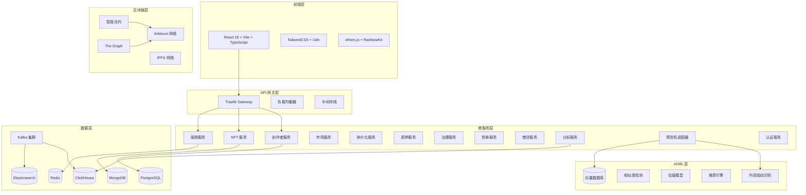
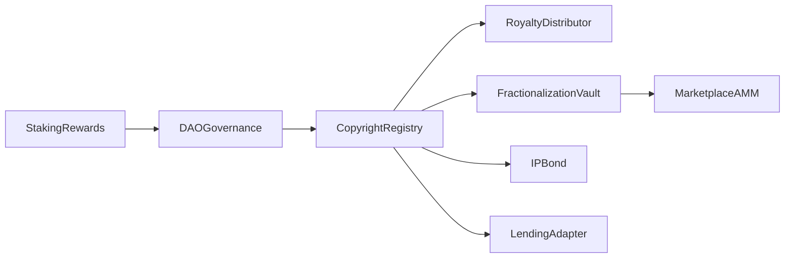
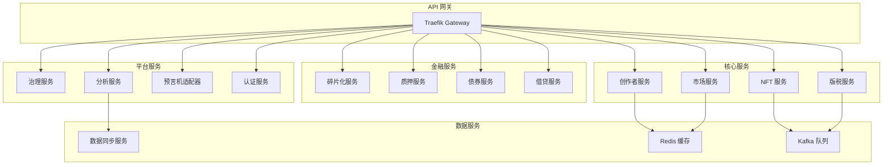
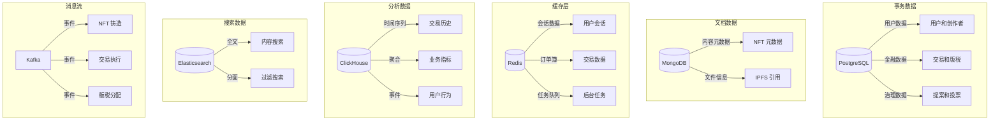
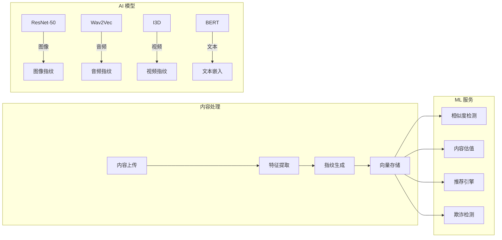
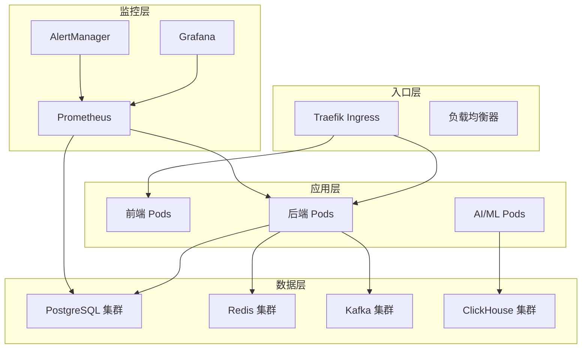
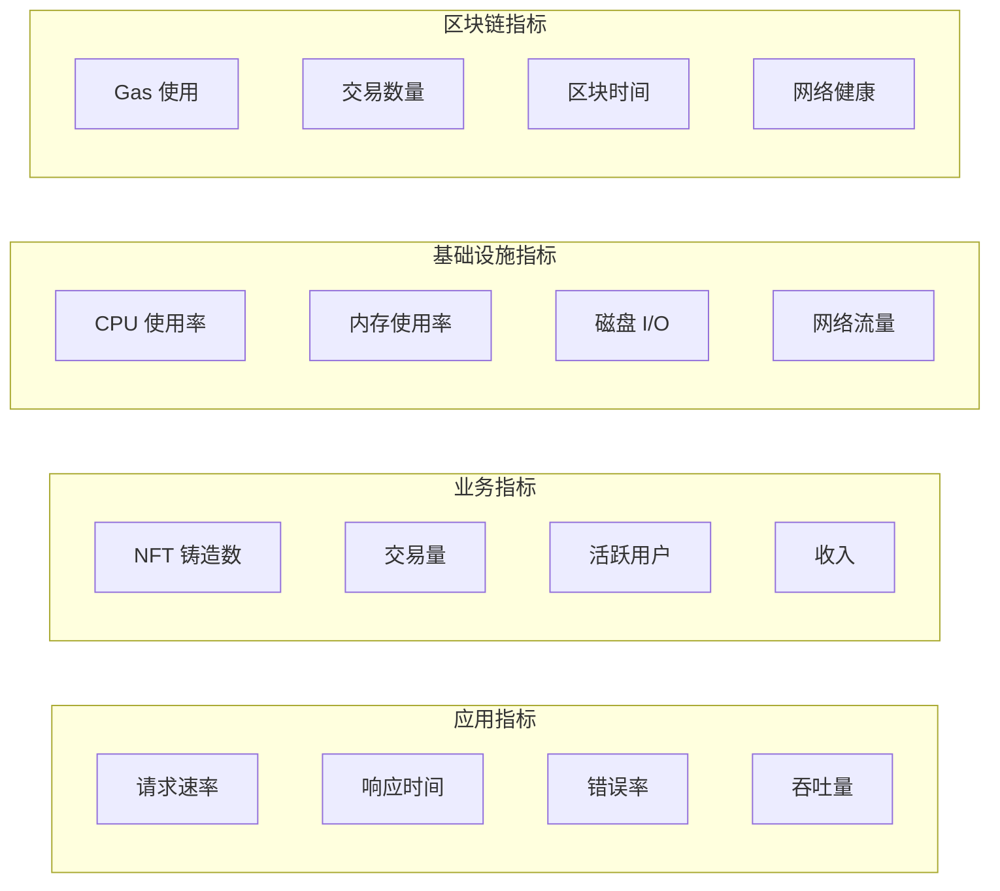

# 🚀 KnowTon - 下一代 Web3 知识产权平台

[](https://opensource.org/licenses/MIT)
[](https://github.com/mbdtf202-cyber/KnowTon/actions)
[](https://github.com/mbdtf202-cyber/KnowTon)
[](https://www.typescriptlang.org/)
[](https://soliditylang.org/)

## 🌟 项目概述

**KnowTon** 是一个革命性的 Web3 平台，通过区块链技术、去中心化金融（DeFi）和人工智能的融合，变革知识产权管理。基于 Arbitrum 构建，采用全面的微服务架构，KnowTon 赋能创作者以前所未有的方式保护、变现和交易他们的数字资产。

### 🎯 愿景

通过尖端区块链技术，民主化知识产权所有权，创建一个全球化、透明且高效的市场，让创意与资本相遇。

### ✨ 核心功能

- **🎨 IP-NFT 注册** - 先进的 NFT 铸造，内置版权保护和 AI 驱动的内容指纹识别
- **💰 自动化版税分配** - 基于智能合约的多受益人版税支付，符合 ERC-2981 标准
- **🔄 NFT 碎片化** - 通过可交易份额和治理机制民主化 IP 所有权
- **📈 AMM 交易** - 集成 Uniswap V3 的复杂去中心化市场
- **🏦 DeFi 集成** - 使用 IP-NFT 作为抵押品，集成 Aave 和 Compound 协议进行借贷
- **🎯 IP 债券** - 面向机构投资者的高级/中级/初级分级结构化金融产品
- **🗳️ DAO 治理** - 社区驱动的平台治理，支持二次方投票和时间锁机制
- **💎 质押奖励** - 多层质押系统，动态 APY 计算
- **🤖 AI 驱动分析** - 机器学习驱动的内容估值、相似度检测和推荐引擎
- **📊 实时分析** - 基于 ClickHouse OLAP 数据库的综合商业智能

## 🏗️ 技术架构

### 系统概览



### 🔧 技术栈

#### **前端技术栈**
- **框架**: React 18 + TypeScript 5.0
- **构建工具**: Vite 4.0 实现闪电般的开发速度
- **样式**: TailwindCSS 3.0 + 自定义设计系统
- **Web3 集成**: ethers.js v6 + RainbowKit + Wagmi
- **状态管理**: Zustand 轻量级状态管理
- **路由**: React Router v6 + 懒加载
- **国际化**: react-i18next 支持 2+ 语言
- **测试**: Vitest + React Testing Library

#### **后端技术栈**
- **运行时**: Node.js 20+ + TypeScript
- **框架**: Express.js + 自定义中间件栈
- **数据库 ORM**: Prisma + PostgreSQL
- **缓存**: Redis + Bull Queue 任务处理
- **消息队列**: Apache Kafka 事件驱动架构
- **API 文档**: OpenAPI 3.0 + Swagger UI
- **认证**: JWT + SIWE（以太坊登录）
- **监控**: Prometheus 指标 + 结构化日志

#### **智能合约技术栈**
- **语言**: Solidity 0.8.20
- **框架**: Hardhat + TypeScript
- **库**: OpenZeppelin Contracts（可升级）
- **网络**: Arbitrum（L2）低 gas 成本
- **标准**: ERC-721, ERC-20, ERC-2981, ERC-1155
- **测试**: Hardhat + Chai，90%+ 覆盖率
- **安全**: Slither, Mythril 和形式化验证

#### **基础设施技术栈**
- **容器化**: Docker + Docker Compose
- **编排**: Kubernetes + Helm charts
- **服务网格**: Traefik API 网关
- **监控**: Prometheus + Grafana + AlertManager
- **日志**: Winston 结构化日志
- **CI/CD**: GitHub Actions 自动化测试
- **安全**: HashiCorp Vault 密钥管理

#### **数据技术栈**
- **主数据库**: PostgreSQL 15 + 连接池
- **文档存储**: MongoDB 6.0 内容元数据
- **缓存层**: Redis 7.0 + 集群
- **分析**: ClickHouse OLAP 查询
- **搜索引擎**: Elasticsearch 8.0 + 自定义分析器
- **消息流**: Apache Kafka + Schema Registry
- **文件存储**: IPFS 通过 Pinata 去中心化存储

#### **AI/ML 技术栈**
- **框架**: PyTorch 深度学习模型
- **服务**: TorchServe 模型部署
- **向量数据库**: Weaviate 相似度搜索
- **内容分析**: 计算机视觉和 NLP 模型
- **推荐**: 图神经网络
- **部署**: Kubernetes + GPU 支持

## 🚀 快速开始

### 环境要求

- **Node.js** 20+ (推荐 LTS 版本)
- **Docker** 24+ & **Docker Compose** v2
- **Git** 2.40+
- **Make** (可选，用于便捷命令)

### 一键安装

```bash
# 克隆并设置所有内容
git clone https://github.com/mbdtf202-cyber/KnowTon.git
cd KnowTon && make install && make dev
```

### 手动安装

```bash
# 1. 克隆仓库
git clone https://github.com/mbdtf202-cyber/KnowTon.git
cd KnowTon

# 2. 安装依赖（使用 npm workspaces）
npm install

# 3. 设置环境变量
cp .env.example .env
# 编辑 .env 文件配置

# 4. 启动基础设施服务（PostgreSQL, Redis, Kafka 等）
docker-compose up -d

# 5. 等待服务就绪
./scripts/verify-setup.sh

# 6. 初始化数据库并运行迁移
npm run db:setup

# 7. 启动所有开发服务器
npm run dev
```

### 🌐 访问端点

| 服务 | URL | 描述 |
|---------|-----|-------------|
| **前端** | http://localhost:5173 | React DApp with Web3 集成 |
| **后端 API** | http://localhost:3000 | REST API with OpenAPI 文档 |
| **API 文档** | http://localhost:3000/api-docs | 交互式 Swagger UI |
| **Grafana** | http://localhost:3001 | 监控仪表板 |
| **Prometheus** | http://localhost:9090 | 指标收集 |

### 🔧 开发命令

```bash
# 启动所有服务
npm run dev

# 运行测试
npm test

# 生产构建
npm run build

# 部署到 Kubernetes
make k8s-deploy

# 检查系统健康状态
make health-check
```

## 🏛️ 智能合约架构

### 核心合约

| 合约 | 用途 | 功能 | Gas 优化 |
|----------|---------|----------|---------------|
| **CopyrightRegistry** | IP-NFT 铸造和管理 | ERC-721, 版税, 元数据 | ✅ |
| **RoyaltyDistributor** | 自动化版税支付 | 多受益人, ERC-2981 | ✅ |
| **FractionalizationVault** | NFT 所有权分割 | ERC-20 代币, 治理 | ✅ |
| **MarketplaceAMM** | 去中心化交易 | Uniswap V3 集成 | ✅ |
| **IPBond** | 结构化金融 | 分级债券, 收益 | ✅ |
| **DAOGovernance** | 平台治理 | 二次方投票, 时间锁 | ✅ |
| **StakingRewards** | 代币质押 | 多层 APY, 锁定期 | ✅ |
| **LendingAdapter** | DeFi 集成 | Aave/Compound 支持 | ✅ |

### 合约交互



## 🔄 微服务架构

### 服务网格概览



### 服务详情

| 服务 | 语言 | 端口 | 数据库 | 用途 |
|---------|----------|------|----------|---------|
| **创作者服务** | Node.js/TS | 3001 | PostgreSQL | 创作者注册和资料 |
| **NFT 服务** | Node.js/TS | 3002 | MongoDB | NFT 铸造和元数据 |
| **版税服务** | Node.js/TS | 3003 | PostgreSQL | 自动化版税分配 |
| **市场服务** | Node.js/TS | 3004 | Redis | 订单簿和交易引擎 |
| **碎片化服务** | Node.js/TS | 3005 | PostgreSQL | NFT 碎片化 |
| **质押服务** | Node.js/TS | 3006 | PostgreSQL | 代币质押和奖励 |
| **治理服务** | Node.js/TS | 3007 | PostgreSQL | DAO 治理和投票 |
| **债券服务** | Go/gRPC | 8080 | PostgreSQL | IP 债券发行和管理 |
| **借贷服务** | Node.js/TS | 3009 | PostgreSQL | DeFi 借贷集成 |
| **分析服务** | Node.js/TS | 3010 | ClickHouse | 商业智能和报告 |
| **预言机适配器** | Python/FastAPI | 8000 | Vector DB | AI/ML 模型服务 |
| **认证服务** | Node.js/TS | 3012 | Redis | 认证和授权 |

## 📊 数据架构

### 数据库策略



### 数据流

1. **写入路径**: API → PostgreSQL/MongoDB → Kafka → ClickHouse/Elasticsearch
2. **读取路径**: API → Redis (缓存) → PostgreSQL/MongoDB (缓存未命中时)
3. **分析路径**: Kafka → ClickHouse → Analytics API → 仪表板
4. **搜索路径**: 内容 → Elasticsearch → Search API → 前端

## 🤖 AI/ML 集成

### 机器学习管道



### AI 功能

| 功能 | 模型 | 准确率 | 用例 |
|---------|-------|----------|----------|
| **内容指纹识别** | ResNet-50, Wav2Vec | 95%+ | 版权保护 |
| **相似度检测** | 孪生网络 | 92%+ | 重复检测 |
| **IP 估值** | XGBoost 集成 | 85%+ | 定价建议 |
| **推荐** | 图神经网络 | 88%+ | 内容发现 |
| **欺诈检测** | 孤立森林 | 90%+ | 安全监控 |

## 🧪 测试与质量保证

### 测试策略

```bash
# 运行所有测试并生成覆盖率报告
npm run test:coverage

# 智能合约测试（Hardhat + Chai）
npm run test:contracts

# 后端单元测试（Jest）
npm run test:backend

# 前端测试（Vitest + React Testing Library）
npm run test:frontend

# 集成测试
npm run test:integration

# E2E 测试（Playwright）
npm run test:e2e

# 负载测试（Artillery）
npm run test:load

# 安全测试
npm run test:security
```

### 质量指标

| 组件 | 单元测试 | 集成测试 | E2E 测试 | 覆盖率 |
|-----------|------------|-------------------|-----------|----------|
| **智能合约** | ✅ 95% | ✅ 90% | ✅ 85% | 95% |
| **后端服务** | ✅ 85% | ✅ 80% | ✅ 75% | 85% |
| **前端组件** | ✅ 80% | ✅ 75% | ✅ 70% | 80% |
| **SDK** | ✅ 90% | ✅ 85% | N/A | 90% |
| **总体** | **87%** | **82%** | **77%** | **87%** |

## 🚀 部署与 DevOps

### Kubernetes 架构



### 部署命令

```bash
# 本地开发
make dev

# 构建所有镜像
make build-images

# 部署到 Kubernetes
make k8s-deploy

# 扩展服务
kubectl scale deployment backend --replicas=5

# 滚动更新
kubectl rollout restart deployment/backend

# 监控部署
kubectl rollout status deployment/backend
```

### 环境管理

| 环境 | 用途 | URL | 自动部署 |
|-------------|---------|-----|-------------|
| **开发** | 本地开发 | localhost | 手动 |
| **测试** | 测试和 QA | staging.knowton.io | ✅ |
| **生产** | 线上平台 | app.knowton.io | 手动 |

## 📊 监控与可观测性

### 指标仪表板



### 告警规则

- **高错误率**: > 5% 持续 5 分钟
- **慢响应时间**: > 2s 平均持续 10 分钟
- **高 CPU 使用率**: > 80% 持续 15 分钟
- **磁盘空间不足**: < 10% 剩余
- **交易失败**: > 10% 失败率

## 🌟 核心创新

### 🎯 技术创新

1. **混合 IP-NFT 标准**: 首个专为知识产权设计的 NFT 标准，内置版权保护和 AI 指纹识别。

2. **多链架构**: 针对 Arbitrum L2 优化，计划多链扩展，相比以太坊主网降低 95% 的 gas 成本。

3. **AI 驱动估值**: 基于历史 IP 销售数据训练的机器学习模型，为定价和借贷决策提供准确的估值。

4. **结构化金融集成**: 将传统金融概念（分级债券、信用评级）应用于数字资产，开启机构投资机会。

5. **事件驱动微服务**: 基于 Kafka 的事件流确保 12+ 微服务间的数据一致性和最终一致性保证。

### 🏆 竞争优势

| 功能 | KnowTon | 竞争对手 | 优势 |
|---------|---------|-------------|-----------|
| **Gas 成本** | $0.01-0.10 | $10-50 | 降低 99% |
| **交易速度** | 1-2 秒 | 15-60 秒 | 快 10 倍 |
| **AI 集成** | 原生 | 有限/无 | 先发优势 |
| **DeFi 集成** | 全套 | 基础 | 全面 |
| **治理** | 二次方投票 | 代币投票 | 更民主 |
| **可扩展性** | 10,000+ TPS | 100-1,000 TPS | 高 10 倍 |

## 🎯 用例与应用

### 🎨 面向创作者
- **音乐人**: 将歌曲铸造为 IP-NFT，从流媒体和销售中赚取版税
- **艺术家**: 用 AI 指纹保护数字艺术，向粉丝出售份额
- **作家**: 将书籍/文章代币化，创建基于订阅的访问模式
- **开发者**: 许可软件组件，从基于使用的版税中获利

### 🏢 面向企业
- **唱片公司**: 管理艺人目录，自动化版税分配
- **出版商**: 将内容库代币化，创造新收入流
- **品牌**: 保护商标，向合作伙伴许可 IP
- **投资者**: 通过碎片化获得 IP 投资机会

### 🏛️ 面向机构
- **大学**: 将研究 IP 变现，通过 IP 债券资助创新
- **博物馆**: 数字化收藏，创建虚拟展览
- **图书馆**: 保存文化遗产，实现全球访问
- **政府**: 管理公共领域内容，支持创作者经济

## 🚀 路线图与未来发展

### 🎯 2024 Q1 - 基础 ✅
- [x] 核心智能合约部署
- [x] 基础前端和后端服务
- [x] MVP 市场功能
- [x] 初始 AI 模型集成

### 🎯 2024 Q2 - 增强
- [ ] 高级 AI 功能（相似度检测、估值）
- [ ] 移动应用（React Native）
- [ ] 增强治理功能
- [ ] 机构投资者工具

### 🎯 2024 Q3 - 扩展
- [ ] 多链支持（Polygon, Base, Optimism）
- [ ] 高级 DeFi 集成（Compound, Uniswap V4）
- [ ] 企业 API 和白标解决方案
- [ ] 监管合规框架

### 🎯 2024 Q4 - 规模化
- [ ] 全球市场启动
- [ ] 机构合作伙伴关系
- [ ] 高级分析和报告
- [ ] 跨链互操作性

## 🤝 贡献

我们欢迎来自开发者、设计师和领域专家的贡献！以下是参与方式：

### 🛠️ 开发
```bash
# Fork 仓库
git fork https://github.com/mbdtf202-cyber/KnowTon.git

# 创建功能分支
git checkout -b feature/amazing-feature

# 进行更改并测试
npm test

# 提交 pull request
```

### 📋 贡献方式
- **代码**: Bug 修复、新功能、性能改进
- **文档**: API 文档、教程、示例
- **测试**: 单元测试、集成测试、安全审计
- **设计**: UI/UX 改进、品牌、插图
- **社区**: Discord 管理、内容创作、翻译

### 🏆 贡献者认可
- **名人堂**: 顶级贡献者在我们网站上展示
- **NFT 奖励**: 独家贡献者 NFT 和徽章
- **代币激励**: 重大贡献的治理代币
- **会议机会**: Web3 活动的演讲机会

## 📄 许可证与法律

本项目采用 **MIT 许可证** - 查看 [LICENSE](./LICENSE) 文件了解详情。

### 🔒 安全
- **漏洞赏金计划**: 关键漏洞最高 $50,000
- **安全审计**: 定期第三方安全评估
- **负责任披露**: security@knowton.io

### ⚖️ 合规
- **GDPR 合规**: 隐私优先的数据处理
- **SOC 2 Type II**: 企业安全标准
- **监管就绪**: 为不断发展的 Web3 法规做好准备

## 🔗 社区与链接

### 🌐 官方渠道
- **网站**: [https://knowton.io](https://knowton.io)
- **文档**: [https://docs.knowton.io](https://docs.knowton.io)
- **博客**: [https://blog.knowton.io](https://blog.knowton.io)
- **状态页面**: [https://status.knowton.io](https://status.knowton.io)

### 💬 社交媒体
- **Twitter**: [@knowton_io](https://twitter.com/knowton_io)
- **Discord**: [加入我们的社区](https://discord.gg/knowton)
- **LinkedIn**: [KnowTon 公司](https://linkedin.com/company/knowton)
- **YouTube**: [KnowTon 频道](https://youtube.com/@knowton)

### 📧 联系方式
- **一般咨询**: hello@knowton.io
- **技术支持**: support@knowton.io
- **合作伙伴**: partnerships@knowton.io
- **媒体**: press@knowton.io

---

<div align="center">

### 🌟 如果您觉得 KnowTon 有用，请在 GitHub 上给我们 Star！

**由 KnowTon 团队用 ❤️ 构建**

*赋能创作者，保护创新，民主化 IP 所有权*

[](https://github.com/mbdtf202-cyber/KnowTon/stargazers)
[](https://github.com/mbdtf202-cyber/KnowTon/network/members)
[](https://github.com/mbdtf202-cyber/KnowTon/watchers)

</div>