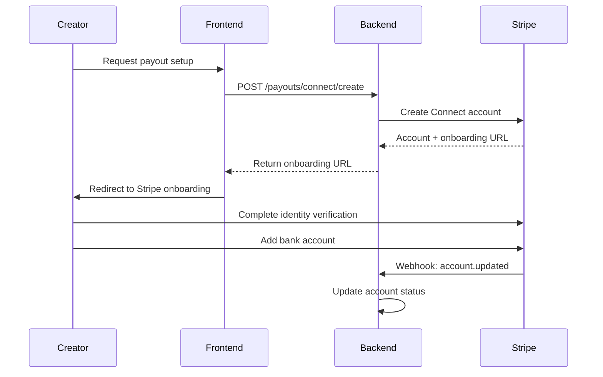
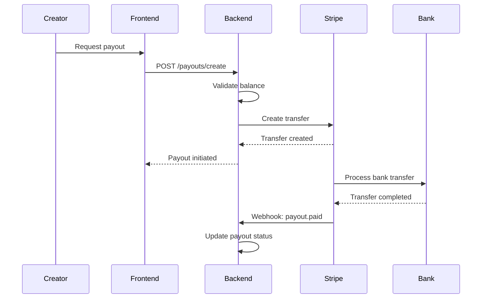

# Bank Transfer Payout Integration

## Overview

The KnowTon platform integrates with Stripe Connect to enable creators to receive payouts directly to their bank accounts. This system handles the complete payout lifecycle including account onboarding, bank verification, payout processing, and receipt generation.

## Features

- ✅ Stripe Connect Express account creation
- ✅ Automated onboarding flow with identity verification
- ✅ Bank account verification (micro-deposits or instant verification)
- ✅ Secure payout processing with status tracking
- ✅ Payout history and analytics
- ✅ PDF receipt generation
- ✅ Webhook handling for real-time status updates
- ✅ Multi-currency support (USD, EUR, CNY, JPY)
- ✅ Minimum payout threshold ($50)
- ✅ Transparent fee structure (2.5% for bank transfers)

## Architecture

### Components

1. **PayoutService** (`src/services/payout.service.ts`)
   - Core business logic for payout operations
   - Stripe Connect account management
   - Bank account verification
   - Payout creation and tracking
   - Receipt generation

2. **Payout Routes** (`src/routes/payout.routes.ts`)
   - RESTful API endpoints
   - Request validation
   - Webhook handling

3. **Database Models** (Prisma)
   - `StripeConnectAccount`: Creator Connect account details
   - `Payout`: Payout transaction records

## API Endpoints

### 1. Create Stripe Connect Account

**POST** `/api/v1/payouts/connect/create`

Creates a Stripe Connect Express account for a creator and generates an onboarding link.

**Request Body:**
```json
{
  "userId": "creator-123",
  "email": "creator@example.com",
  "country": "US",
  "businessType": "individual",
  "metadata": {
    "creatorName": "John Doe"
  }
}
```

**Response:**
```json
{
  "success": true,
  "data": {
    "accountId": "acct_xxxxxxxxxxxxx",
    "status": "pending",
    "onboardingUrl": "https://connect.stripe.com/setup/..."
  }
}
```

### 2. Get Connect Account Details

**GET** `/api/v1/payouts/connect/:userId`

Retrieves the current status and details of a creator's Connect account.

**Response:**
```json
{
  "success": true,
  "data": {
    "accountId": "acct_xxxxxxxxxxxxx",
    "email": "creator@example.com",
    "country": "US",
    "status": "active",
    "payoutsEnabled": true,
    "capabilities": {
      "card_payments": "active",
      "transfers": "active"
    },
    "externalAccounts": [
      {
        "id": "ba_xxxxxxxxxxxxx",
        "object": "bank_account",
        "bank_name": "STRIPE TEST BANK",
        "last4": "6789",
        "status": "verified"
      }
    ]
  }
}
```

### 3. Add Bank Account

**POST** `/api/v1/payouts/connect/bank-account`

Adds a bank account to the creator's Connect account.

**Request Body:**
```json
{
  "userId": "creator-123",
  "bankAccountToken": "btok_xxxxxxxxxxxxx"
}
```

**Response:**
```json
{
  "success": true,
  "data": {
    "bankAccountId": "ba_xxxxxxxxxxxxx",
    "last4": "6789",
    "bankName": "STRIPE TEST BANK",
    "status": "new"
  }
}
```

### 4. Verify Bank Account

**POST** `/api/v1/payouts/connect/verify-bank`

Verifies a bank account using micro-deposit amounts (if required).

**Request Body:**
```json
{
  "userId": "creator-123",
  "accountId": "ba_xxxxxxxxxxxxx",
  "amounts": [32, 45]
}
```

**Response:**
```json
{
  "success": true,
  "data": {
    "verified": true,
    "accountId": "ba_xxxxxxxxxxxxx"
  }
}
```

### 5. Create Payout

**POST** `/api/v1/payouts/create`

Initiates a payout to the creator's bank account.

**Request Body:**
```json
{
  "userId": "creator-123",
  "amount": 500,
  "currency": "USD",
  "description": "Monthly earnings payout",
  "metadata": {
    "period": "2024-01"
  }
}
```

**Response:**
```json
{
  "success": true,
  "data": {
    "payoutId": "payout_xxxxxxxxxxxxx",
    "transferId": "tr_xxxxxxxxxxxxx",
    "amount": 500,
    "currency": "USD",
    "fee": 12.50,
    "netAmount": 487.50,
    "status": "pending",
    "estimatedArrival": "2024-02-05"
  }
}
```

### 6. Get Payout Details

**GET** `/api/v1/payouts/:payoutId`

Retrieves details of a specific payout.

**Response:**
```json
{
  "success": true,
  "data": {
    "id": "payout_xxxxxxxxxxxxx",
    "userId": "creator-123",
    "amount": 500,
    "currency": "USD",
    "fee": 12.50,
    "netAmount": 487.50,
    "status": "completed",
    "description": "Monthly earnings payout",
    "createdAt": "2024-02-01T10:00:00Z",
    "completedAt": "2024-02-05T14:30:00Z"
  }
}
```

### 7. Get Payout History

**GET** `/api/v1/payouts/history/:userId`

Retrieves payout history for a creator with pagination and filtering.

**Query Parameters:**
- `limit` (optional): Number of records per page (default: 20)
- `offset` (optional): Pagination offset (default: 0)
- `status` (optional): Filter by status (pending, processing, completed, failed)
- `startDate` (optional): Filter by start date
- `endDate` (optional): Filter by end date

**Response:**
```json
{
  "success": true,
  "data": {
    "payouts": [
      {
        "id": "payout_xxxxxxxxxxxxx",
        "amount": 500,
        "currency": "USD",
        "fee": 12.50,
        "netAmount": 487.50,
        "status": "completed",
        "createdAt": "2024-02-01T10:00:00Z",
        "completedAt": "2024-02-05T14:30:00Z"
      }
    ],
    "total": 15,
    "limit": 20,
    "offset": 0,
    "totalPaid": 7500.00
  }
}
```

### 8. Download Payout Receipt

**GET** `/api/v1/payouts/:payoutId/receipt`

Generates and downloads a PDF receipt for a payout.

**Response:**
- Content-Type: `application/pdf`
- Content-Disposition: `attachment; filename=payout-receipt-{payoutId}.pdf`

### 9. Stripe Connect Webhook

**POST** `/api/v1/payouts/webhook/connect`

Handles Stripe Connect webhook events for real-time status updates.

**Supported Events:**
- `account.updated`: Connect account status changes
- `transfer.created`: Transfer initiated
- `transfer.updated`: Transfer status updated
- `transfer.reversed`: Transfer reversed/failed
- `payout.paid`: Payout completed
- `payout.failed`: Payout failed

## Payout Flow

### 1. Account Setup (One-time)



### 2. Payout Request



## Fee Structure

| Transfer Type | Fee | Processing Time |
|--------------|-----|-----------------|
| Bank Transfer (US) | 2.5% | 3 business days |
| Bank Transfer (EU) | 2.5% | 5 business days |
| Instant Payout | 1.5% + $0.50 | 30 minutes |

**Minimum Payout:** $50

## Status Lifecycle

### Connect Account Status
- `pending`: Account created, onboarding not completed
- `active`: Account verified, payouts enabled
- `restricted`: Account under review
- `disabled`: Account disabled

### Payout Status
- `pending`: Payout initiated, awaiting processing
- `processing`: Transfer in progress
- `completed`: Funds delivered to bank account
- `failed`: Payout failed (insufficient funds, account issues, etc.)

## Error Handling

### Common Errors

| Error | Cause | Solution |
|-------|-------|----------|
| `Connect account not found` | User hasn't set up payouts | Complete onboarding first |
| `Payouts not enabled` | Onboarding incomplete | Complete identity verification |
| `Minimum payout amount is $50` | Amount below threshold | Request at least $50 |
| `Insufficient balance` | Not enough funds | Wait for more earnings |
| `Transfer reversed` | Bank account issues | Verify bank account details |

## Security Considerations

1. **Webhook Verification**: All webhooks are verified using Stripe signatures
2. **Account Ownership**: User ID is validated for all operations
3. **Balance Validation**: Available balance is checked before payouts
4. **Audit Trail**: All payout operations are logged
5. **PCI Compliance**: Bank account tokens are handled securely

## Testing

### Test Mode

Use Stripe test mode for development:

```bash
# Set test API keys in .env
STRIPE_SECRET_KEY=sk_test_...
STRIPE_CONNECT_WEBHOOK_SECRET=whsec_...
```

### Run Integration Tests

```bash
npm run test:payout
```

### Test Script

```bash
tsx src/scripts/test-payout-integration.ts
```

## Configuration

### Environment Variables

```env
# Stripe Configuration
STRIPE_SECRET_KEY=sk_live_...
STRIPE_CONNECT_WEBHOOK_SECRET=whsec_...

# Frontend URLs
FRONTEND_URL=https://knowton.io

# Database
DATABASE_URL=postgresql://...
```

### Webhook Setup

1. Go to Stripe Dashboard → Developers → Webhooks
2. Add endpoint: `https://api.knowton.io/api/v1/payouts/webhook/connect`
3. Select events:
   - `account.updated`
   - `transfer.created`
   - `transfer.updated`
   - `transfer.reversed`
   - `payout.paid`
   - `payout.failed`
4. Copy webhook signing secret to `STRIPE_CONNECT_WEBHOOK_SECRET`

## Monitoring

### Key Metrics

- Total payouts processed
- Average payout amount
- Payout success rate
- Average processing time
- Failed payout reasons

### Logs

All payout operations are logged with structured data:

```typescript
logger.info('Payout created', {
  payoutId: 'payout_xxx',
  userId: 'creator-123',
  amount: 500,
  currency: 'USD',
});
```

## Support

For issues or questions:
- Check logs in CloudWatch/your logging service
- Review Stripe Dashboard for transfer details
- Contact Stripe Support for payment issues
- Review webhook events for debugging

## References

- [Stripe Connect Documentation](https://stripe.com/docs/connect)
- [Stripe Payouts Guide](https://stripe.com/docs/payouts)
- [Stripe Webhooks](https://stripe.com/docs/webhooks)
