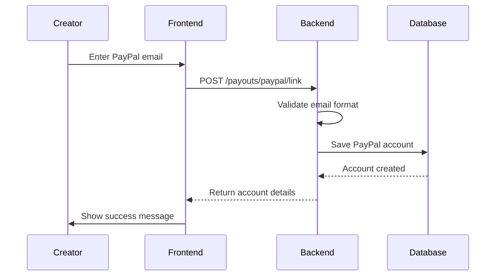
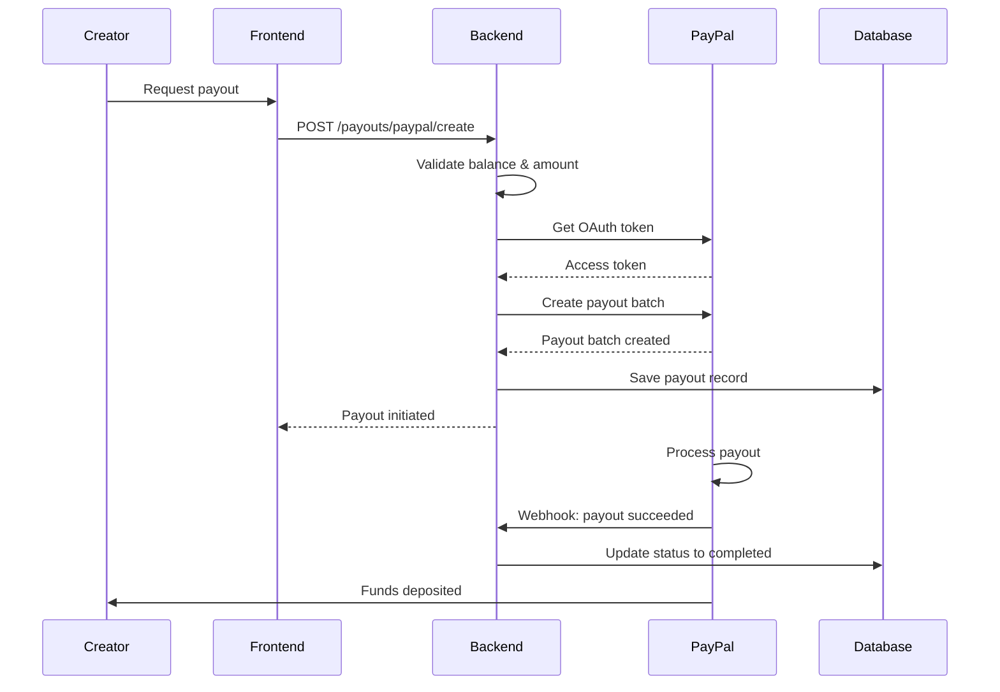
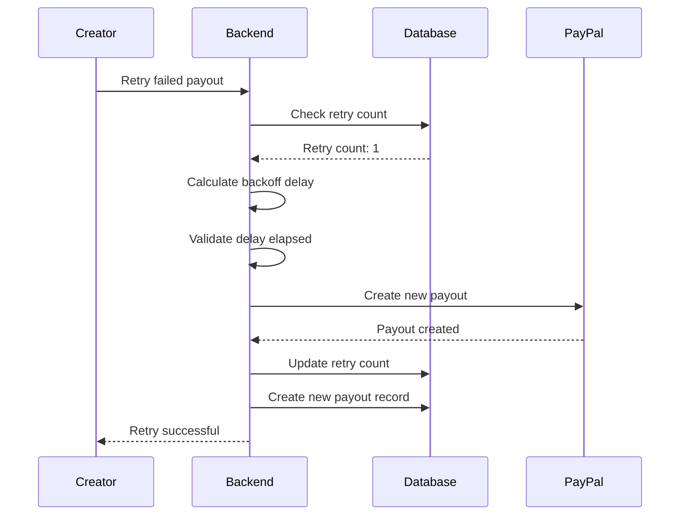

# PayPal Payout Integration

## Overview

The KnowTon platform integrates with PayPal Payouts API to enable creators to receive instant payouts directly to their PayPal accounts. This system provides a faster and more cost-effective alternative to traditional bank transfers.

## Features

- ✅ PayPal account linking with email verification
- ✅ Instant payout processing (funds available within minutes)
- ✅ Lower fees (1% vs 2.5% for bank transfers)
- ✅ Automatic retry logic with exponential backoff
- ✅ Real-time status tracking via webhooks
- ✅ Multi-currency support (USD, EUR, CNY, JPY)
- ✅ Minimum payout threshold ($50)
- ✅ Comprehensive error handling

## Architecture

### Components

1. **PayPalService** (`src/services/paypal.service.ts`)
   - OAuth token management with caching
   - PayPal account linking
   - Payout creation and tracking
   - Retry logic with exponential backoff
   - Webhook event handling

2. **Payout Routes** (`src/routes/payout.routes.ts`)
   - RESTful API endpoints for PayPal operations
   - Request validation
   - Webhook handling

3. **Database Models** (Prisma)
   - `PayPalAccount`: Creator PayPal account details
   - `Payout`: Enhanced with PayPal-specific fields

## API Endpoints

### 1. Link PayPal Account

**POST** `/api/v1/payouts/paypal/link`

Links a PayPal account to a creator's profile.

**Request Body:**
```json
{
  "userId": "creator-123",
  "paypalEmail": "creator@example.com",
  "metadata": {
    "source": "dashboard"
  }
}
```

**Response:**
```json
{
  "success": true,
  "data": {
    "accountId": "paypal_acc_xxxxxxxxxxxxx",
    "paypalEmail": "creator@example.com",
    "status": "verified"
  }
}
```

**Validation:**
- Email format validation
- Duplicate account check
- Auto-verification (can be enhanced with PayPal verification API)

### 2. Get PayPal Account Details

**GET** `/api/v1/payouts/paypal/:userId`

Retrieves PayPal account information for a creator.

**Response:**
```json
{
  "success": true,
  "data": {
    "accountId": "paypal_acc_xxxxxxxxxxxxx",
    "paypalEmail": "creator@example.com",
    "status": "verified",
    "verifiedAt": "2024-02-01T10:00:00Z",
    "createdAt": "2024-01-15T08:30:00Z"
  }
}
```

### 3. Create PayPal Payout

**POST** `/api/v1/payouts/paypal/create`

Initiates an instant payout to the creator's PayPal account.

**Request Body:**
```json
{
  "userId": "creator-123",
  "amount": 500,
  "currency": "USD",
  "description": "Monthly earnings payout",
  "metadata": {
    "period": "2024-01"
  }
}
```

**Response:**
```json
{
  "success": true,
  "data": {
    "payoutId": "payout_xxxxxxxxxxxxx",
    "paypalPayoutId": "PAYOUTITEM_xxxxxxxxxxxxx",
    "amount": 500,
    "currency": "USD",
    "fee": 5.00,
    "netAmount": 495.00,
    "status": "processing",
    "estimatedArrival": "Instant (within minutes)"
  }
}
```

**Validations:**
- Minimum amount: $50
- PayPal account must be linked and verified
- Sufficient balance check
- Currency validation

### 4. Get PayPal Payout Status

**GET** `/api/v1/payouts/paypal/status/:payoutId`

Retrieves the current status of a PayPal payout.

**Response:**
```json
{
  "success": true,
  "data": {
    "payoutId": "payout_xxxxxxxxxxxxx",
    "paypalPayoutId": "PAYOUTITEM_xxxxxxxxxxxxx",
    "status": "completed",
    "batchStatus": "SUCCESS",
    "transactionStatus": "SUCCESS",
    "failureReason": null,
    "completedAt": "2024-02-01T10:05:00Z"
  }
}
```

**Status Values:**
- `pending`: Payout initiated
- `processing`: Being processed by PayPal
- `completed`: Funds delivered to PayPal account
- `failed`: Payout failed (see failureReason)

### 5. Retry Failed Payout

**POST** `/api/v1/payouts/paypal/retry/:payoutId`

Retries a failed payout with exponential backoff.

**Response:**
```json
{
  "success": true,
  "data": {
    "payoutId": "payout_new_xxxxxxxxxxxxx",
    "paypalPayoutId": "PAYOUTITEM_new_xxxxxxxxxxxxx",
    "amount": 500,
    "currency": "USD",
    "fee": 5.00,
    "netAmount": 495.00,
    "status": "processing",
    "estimatedArrival": "Instant (within minutes)"
  }
}
```

**Retry Logic:**
- Maximum 3 retry attempts
- Exponential backoff: 1min, 2min, 4min
- Only failed payouts can be retried
- Creates new payout record for each retry

### 6. PayPal Webhook Handler

**POST** `/api/v1/payouts/webhook/paypal`

Handles PayPal webhook events for real-time status updates.

**Supported Events:**
- `PAYMENT.PAYOUTS-ITEM.SUCCEEDED`: Payout completed successfully
- `PAYMENT.PAYOUTS-ITEM.FAILED`: Payout failed
- `PAYMENT.PAYOUTS-ITEM.BLOCKED`: Payout blocked by PayPal
- `PAYMENT.PAYOUTS-ITEM.REFUNDED`: Payout refunded

## Payout Flow

### Account Linking Flow



### Payout Request Flow



### Retry Flow



## Fee Structure

| Transfer Type | Fee | Processing Time | Availability |
|--------------|-----|-----------------|--------------|
| PayPal Payout | 1% | Instant (minutes) | Immediate |
| Bank Transfer | 2.5% | 3-5 business days | 3-5 days |

**Minimum Payout:** $50

**Fee Comparison Example:**
- $500 payout via PayPal: $5 fee, $495 net (instant)
- $500 payout via Bank: $12.50 fee, $487.50 net (3-5 days)

## Error Handling

### Common Errors

| Error | Cause | Solution |
|-------|-------|----------|
| `PayPal account not linked` | User hasn't linked PayPal | Link PayPal account first |
| `PayPal account not verified` | Account verification pending | Complete verification |
| `Minimum payout amount is $50` | Amount below threshold | Request at least $50 |
| `Insufficient balance` | Not enough funds | Wait for more earnings |
| `Maximum retry attempts reached` | 3 retries exhausted | Contact support |
| `Please wait X seconds before retrying` | Retry too soon | Wait for backoff period |

### PayPal-Specific Errors

| PayPal Error | Meaning | Action |
|-------------|---------|--------|
| `INSUFFICIENT_FUNDS` | PayPal account balance low | Retry later |
| `RECEIVER_UNREGISTERED` | Email not registered with PayPal | Verify email address |
| `BLOCKED` | Payout blocked by PayPal | Contact PayPal support |
| `REFUNDED` | Payout was refunded | Check PayPal account |

## Retry Logic

### Exponential Backoff Strategy

```typescript
// Retry delays
Retry 1: 1 minute (2^0 * 60s)
Retry 2: 2 minutes (2^1 * 60s)
Retry 3: 4 minutes (2^2 * 60s)
Max retries: 3
```

### Retry Conditions

- Only `failed` status payouts can be retried
- Must wait for backoff period between retries
- Maximum 3 retry attempts per payout
- Each retry creates a new payout record
- Original payout tracks retry count

### Implementation

```typescript
const retryDelay = Math.pow(2, retryCount) * 60 * 1000;
const timeSinceLastRetry = Date.now() - lastRetryAt.getTime();

if (timeSinceLastRetry < retryDelay) {
  throw new Error(`Please wait ${waitTime} seconds before retrying`);
}
```

## Security Considerations

1. **OAuth Token Management**
   - Tokens cached with 5-minute safety margin
   - Automatic token refresh on expiry
   - Secure credential storage

2. **Email Validation**
   - Format validation using regex
   - Duplicate account prevention
   - Case-insensitive email matching

3. **Balance Validation**
   - Real-time balance calculation
   - Prevents overdraft
   - Includes pending payouts

4. **Webhook Verification**
   - PayPal signature verification (to be implemented)
   - Event deduplication
   - Idempotent processing

5. **Audit Trail**
   - All operations logged
   - Retry attempts tracked
   - Status changes recorded

## Testing

### Test Mode

Use PayPal Sandbox for development:

```bash
# Set sandbox credentials in .env
PAYPAL_CLIENT_ID=your_sandbox_client_id
PAYPAL_CLIENT_SECRET=your_sandbox_client_secret
PAYPAL_API_BASE_URL=https://api-m.sandbox.paypal.com
```

### Test Accounts

Create test accounts in PayPal Developer Dashboard:
- Business account (for platform)
- Personal accounts (for creators)

### Test Scenarios

1. **Successful Payout**
   ```bash
   curl -X POST http://localhost:3000/api/v1/payouts/paypal/create \
     -H "Content-Type: application/json" \
     -d '{
       "userId": "test-user-123",
       "amount": 100,
       "currency": "USD",
       "description": "Test payout"
     }'
   ```

2. **Failed Payout (Insufficient Balance)**
   ```bash
   # Request payout exceeding available balance
   ```

3. **Retry Failed Payout**
   ```bash
   curl -X POST http://localhost:3000/api/v1/payouts/paypal/retry/{payoutId}
   ```

4. **Check Payout Status**
   ```bash
   curl http://localhost:3000/api/v1/payouts/paypal/status/{payoutId}
   ```

## Configuration

### Environment Variables

```env
# PayPal Configuration
PAYPAL_CLIENT_ID=your_client_id
PAYPAL_CLIENT_SECRET=your_client_secret
PAYPAL_API_BASE_URL=https://api-m.paypal.com  # Production
# PAYPAL_API_BASE_URL=https://api-m.sandbox.paypal.com  # Sandbox

# Database
DATABASE_URL=postgresql://...
```

### PayPal App Setup

1. Go to [PayPal Developer Dashboard](https://developer.paypal.com/dashboard/)
2. Create a new app
3. Enable "Payouts" capability
4. Copy Client ID and Secret
5. Configure webhook URL: `https://api.knowton.io/api/v1/payouts/webhook/paypal`
6. Subscribe to events:
   - `PAYMENT.PAYOUTS-ITEM.SUCCEEDED`
   - `PAYMENT.PAYOUTS-ITEM.FAILED`
   - `PAYMENT.PAYOUTS-ITEM.BLOCKED`
   - `PAYMENT.PAYOUTS-ITEM.REFUNDED`

## Monitoring

### Key Metrics

- Total PayPal payouts processed
- Average payout amount
- Payout success rate
- Average processing time
- Retry rate
- Failed payout reasons

### Logs

All PayPal operations are logged with structured data:

```typescript
logger.info('PayPal payout created', {
  payoutId: 'payout_xxx',
  paypalPayoutId: 'PAYOUTITEM_xxx',
  userId: 'creator-123',
  amount: 500,
  currency: 'USD',
});
```

### Alerts

Set up alerts for:
- High failure rate (>5%)
- Repeated retry failures
- OAuth token refresh failures
- Webhook processing errors

## Comparison: PayPal vs Bank Transfer

| Feature | PayPal | Bank Transfer |
|---------|--------|---------------|
| Processing Time | Instant (minutes) | 3-5 business days |
| Fee | 1% | 2.5% |
| Minimum Amount | $50 | $50 |
| Setup Complexity | Simple (email only) | Complex (bank details, verification) |
| Availability | Immediate | After verification |
| International | Yes (limited countries) | Yes (more countries) |
| Retry Logic | Automatic | Manual |

## Best Practices

1. **For Creators**
   - Link PayPal account early
   - Verify email address is correct
   - Ensure PayPal account is in good standing
   - Choose PayPal for faster access to funds

2. **For Platform**
   - Monitor retry rates
   - Set up proper alerting
   - Cache OAuth tokens efficiently
   - Handle webhooks idempotently
   - Log all operations for debugging

3. **For Support**
   - Check payout status first
   - Review failure reasons
   - Verify PayPal account status
   - Check retry history
   - Escalate to PayPal if needed

## Troubleshooting

### Payout Stuck in Processing

1. Check PayPal payout status via API
2. Review webhook events
3. Verify PayPal account status
4. Check for PayPal service issues

### Payout Failed

1. Review `failureReason` in database
2. Check PayPal account status
3. Verify email address is correct
4. Ensure sufficient balance
5. Try retry if within limits

### Webhook Not Received

1. Verify webhook URL is correct
2. Check webhook signature verification
3. Review PayPal webhook logs
4. Test webhook manually
5. Ensure endpoint is accessible

## Support

For issues or questions:
- Check logs for error details
- Review PayPal Dashboard for payout status
- Contact PayPal Support for payment issues
- Review webhook events for debugging
- Check retry history for failed payouts

## References

- [PayPal Payouts API Documentation](https://developer.paypal.com/docs/api/payments.payouts-batch/v1/)
- [PayPal OAuth 2.0](https://developer.paypal.com/api/rest/authentication/)
- [PayPal Webhooks](https://developer.paypal.com/api/rest/webhooks/)
- [PayPal Error Codes](https://developer.paypal.com/api/rest/reference/orders/v2/errors/)

## Changelog

### Version 1.0.0 (2024-02-01)
- Initial PayPal Payouts integration
- Account linking functionality
- Instant payout processing
- Retry logic with exponential backoff
- Webhook event handling
- Comprehensive error handling
- Multi-currency support
